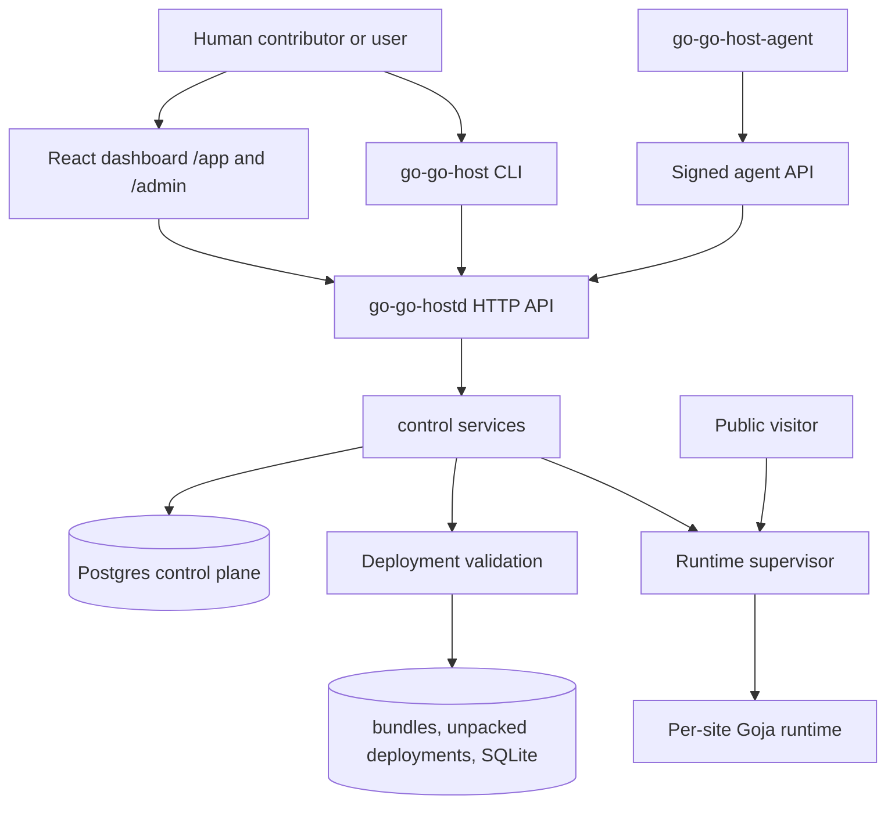

# Contributing to go-go-host

This repository is a hosting platform, not a single-purpose command-line tool. A change may begin as a small button, a route, or a field in a manifest, but that change often crosses several boundaries: React state, HTTP transport, control-plane authorization, Postgres rows, deployment validation, Goja runtime construction, and operational documentation. The goal of these contribution guides is to help you see those boundaries before you write code.

A contributor who understands the boundaries can make a local change without creating global confusion. A contributor who skips them can easily put authorization in the UI, duplicate runtime policy in a CLI, bypass audit logging, or build a dashboard page that looks unrelated to the rest of the product.

## The system in one page

`go-go-host` hosts small server-side JavaScript sites inside Go. Humans use the dashboard or `go-go-host` CLI to create organizations, sites, deployments, agents, and settings. Machines use `go-go-host-agent` with signed requests and short-lived deploy runs. The daemon stores control-plane state in Postgres, validates immutable bundle uploads, activates one Goja runtime per live site, and routes public traffic by host name.



The most important rule is that each layer has a job. HTTP handlers decode requests and choose status codes. Control services enforce product rules. Store wrappers and sqlc queries persist data. Runtime code owns Goja and hosted capabilities. Dashboard code presents state and calls APIs; it does not decide what the server should allow.

## Choose your contribution lane

Start by naming the lane. The lane tells you which files to read first, which invariants matter, and which validation commands are required.

| If you are changing... | Start here | Then read |
|---|---|---|
| HTTP routes, product behavior, permissions, audit, org/site/deployment logic | [`backend-service-guidelines.md`](backend-service-guidelines.md) | [`../architecture/api-surface.md`](../architecture/api-surface.md), [`../architecture/data-model.md`](../architecture/data-model.md) |
| Bundle manifests, validation, capabilities, activation, rollback, hosted JS modules | [`runtime-and-deployment-guidelines.md`](runtime-and-deployment-guidelines.md) | [`../architecture/architecture-map.md`](../architecture/architecture-map.md) |
| Dashboard pages, components, routing, Storybook, visual design | [`frontend-dashboard-guidelines.md`](frontend-dashboard-guidelines.md) | [`playbooks/os1-admin-dashboard-ui-work-guidelines.md`](playbooks/os1-admin-dashboard-ui-work-guidelines.md) |
| Tests, builds, CI confidence, web embedding | [`testing-and-validation.md`](testing-and-validation.md) | [`../runbooks/local-development.md`](../runbooks/local-development.md) |
| Ticket docs, diaries, runbooks, design reports | [`docmgr-and-ticket-workflow.md`](docmgr-and-ticket-workflow.md) | Existing `ttmp/2026/05/*` tickets |
| General orientation | [`architecture-map.md`](architecture-map.md) | The repository `README.md` and `AGENT.md` |

## A small example: where should a new setting go?

Suppose a contributor wants to add a per-site request timeout setting. It is tempting to start in the dashboard, because that is where the user will see the form. But the dashboard is the last layer, not the first one.

The change really belongs to several layers:

1. The schema stores the setting or derives it from existing quota rows.
2. A store wrapper reads and writes it.
3. A control service checks whether the actor may update it.
4. An HTTP handler exposes it as a stable JSON DTO.
5. The runtime activation path passes it into `runtime.Spec`.
6. The dashboard edits it through RTK Query.
7. Tests prove forbidden and allowed updates, runtime wiring, and UI states.
8. Docs explain what the setting does and how to validate it.

That sequence is slower than editing one React component, but it produces a system feature rather than a screen that only looks like one.

## Stop and ask before changing these things

Some changes are expensive because they alter the platform's safety model. Pause and ask for review before you:

- Expose a new hosted JavaScript capability, especially filesystem, network, process, or host environment access.
- Change deployment activation semantics, rollback behavior, bundle path validation, or manifest validation.
- Add backwards-compatibility layers or adapters that were not explicitly requested.
- Change authentication, platform-admin bootstrap, signed-agent verification, nonce handling, or upload-token semantics.
- Add a schema migration that cannot be rolled forward safely on existing development data.
- Diverge from the OS1 dashboard visual system or duplicate the dashboard playbook in a new style.
- Start a long debugging loop after two failed fixes. Step back, write down what is known, and ask whether the approach is wrong.

## Minimum validation

The minimum validation for most code changes is:

```bash
go test ./...
go build ./...
```

Frontend changes usually add:

```bash
cd web/admin
pnpm build
pnpm storybook:build
```

Documentation ticket work adds:

```bash
docmgr doctor --ticket <TICKET-ID> --stale-after 30
```

The full matrix lives in [`testing-and-validation.md`](testing-and-validation.md). Use the matrix rather than guessing.

## What good contributions leave behind

A good contribution leaves the repository easier to work in than it found it. That does not mean every pull request needs a long design document. It means the durable knowledge should land somewhere appropriate:

- Code comments explain invariants that are easy to break.
- Tests name the behavior they protect.
- Stable docs describe mature workflows and contribution rules.
- `ttmp` tickets preserve investigation, false starts, screenshots, and design tradeoffs.
- Changelogs and diaries make future debugging easier.

The product will grow through many small changes. These guides exist so those changes add up to one coherent system.
