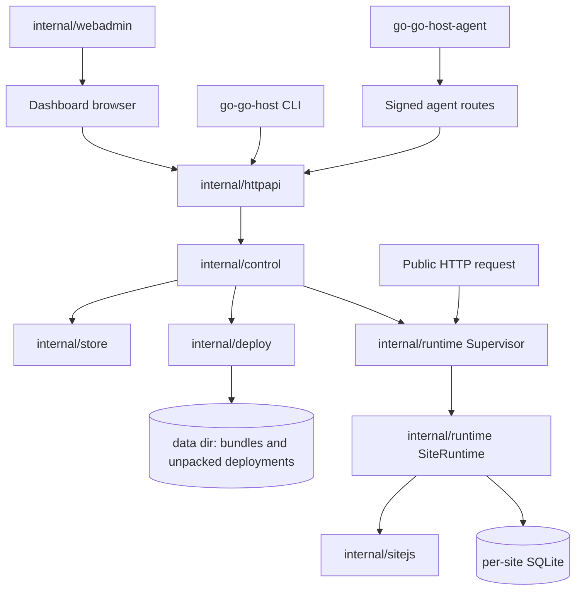

# Architecture map

This document maps the main `go-go-host` subsystems and explains where different kinds of changes belong. Use it before adding new APIs, runtime features, dashboard pages, deployment behavior, or persistence changes.

## High-level system



## Main responsibilities

| Subsystem | Responsibility | Key files |
|---|---|---|
| Daemon startup | Load config, open store, apply migrations, create `control.Core`, start HTTP server. | `cmd/go-go-hostd/main.go` |
| HTTP API | Register routes, authenticate requests, decode input, call control services, encode DTOs. | `internal/httpapi/handler.go`, `internal/httpapi/*.go` |
| Control services | Enforce product rules, permissions, audit events, and orchestration. | `internal/control/core.go`, `internal/control/*.go` |
| Store | Manage Postgres access, migrations, generated queries, and store models. | `internal/store/store.go`, `internal/store/migrations`, `internal/store/queries` |
| Deployment validation | Read archives, validate paths, parse manifests, enforce safe capabilities, store bundle artifacts. | `internal/deploy/bundle.go`, `internal/control/deployments.go` |
| Runtime supervisor | Track active runtimes by site and host; activate, restart, stop, and report runtime status. | `internal/runtime/supervisor.go` |
| Site runtime | Construct a Goja runtime for one site deployment; wire modules, SQLite, static assets, and health checks. | `internal/runtime/runtime.go` |
| JavaScript host API | Provide `express`, request/response DTOs, UI DSL rendering, database guard, sessions, and route matching. | `internal/sitejs/web`, `internal/sitejs/uidsl`, `internal/sitejs/dbguard` |
| Embedded dashboard | Serve built Vite assets and fallback to `index.html` for SPA routes. | `internal/webadmin/handler.go`, `cmd/build-web/main.go` |
| React dashboard | Implement `/app` and `/admin` pages, RTK Query state, MSW fixtures, Storybook stories, and OS1 UI. | `web/admin/src` |

## Request paths

### Human dashboard or CLI API request

```text
Dashboard/CLI
  -> internal/httpapi handler
      -> requirePrincipal / request decoding
      -> internal/control service method
          -> authorization and product invariant
          -> internal/store query or runtime/deploy action
          -> audit event for important mutations
      -> response DTO
```

Use this path for user and admin operations. Do not put the product invariant only in the frontend or CLI.

### Signed agent request

```text
go-go-host-agent
  -> /api/v1/agent route
      -> AgentService.VerifySignedRequest
          -> timestamp check
          -> nonce replay check
          -> active agent/key check
          -> Ed25519 signature check
      -> AgentService.CreateDeployRun or upload-token validation
      -> DeploymentService.Upload
```

Use this path for machine deployments. The agent identity is separate from human user identity.

### Deployment activation

```text
DeploymentService.Activate / ActivateAsAgent
  -> check actor permission or agent grant
  -> load deployment and manifest
  -> build runtime.Spec
  -> Supervisor.Activate
      -> NewSiteRuntime
      -> runtime health check
      -> swap host/site maps
      -> close previous runtime
  -> mark deployment active
  -> write audit event
```

Activation is the live-traffic boundary. Treat changes here as high risk.

### Public hosted-site request

```text
Incoming public HTTP request
  -> fallback routing by Host header
  -> Supervisor lookup
  -> SiteRuntime.ServeHTTP
  -> sitejs/web route match
  -> Goja handler call through runtime owner
  -> HTTP response
```

Public request handling should stay small and fast. Authorization for deployment already happened in the control plane.

## Where to put new code

| Change | Put code here | Do not put it here |
|---|---|---|
| New user/admin endpoint | Handler in `internal/httpapi`; rule in `internal/control`; persistence in `internal/store`. | React-only checks or raw SQL in handler. |
| New database field/entity | Migration, sqlc query, store wrapper, control service tests. | JSON DTO only. |
| New deployment manifest rule | `internal/deploy` validation plus `DeploymentService.Upload` tests. | Dashboard preflight as the only check. |
| New hosted JS module | `internal/sitejs` registrar/module plus runtime capability policy. | Unconditional runtime global. |
| New dashboard page | `web/admin/src/pages`, RTK Query endpoint/types, MSW handler, Storybook stories. | Raw API calls scattered through components. |
| New CLI command | `cmd/go-go-host/cmds` or `cmd/go-go-host-agent/cmds`. | Direct database access. |
| New stable workflow doc | `docs/contributing`, `docs/architecture`, or `docs/runbooks`. | Chat transcript only. |

## Review checklist

Before submitting a change, verify:

- The authoritative rule is in the correct layer.
- The route, control method, store method, and dashboard endpoint names use the same domain language.
- Security-relevant mutations write audit events.
- Runtime and deployment changes include rejected and accepted test cases.
- Dashboard changes include loading, empty, error, and populated states where applicable.
- Stable workflows are documented in `docs`; investigation details are recorded in `ttmp` when using a ticket.
