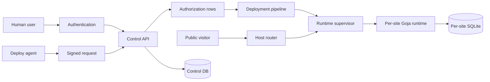
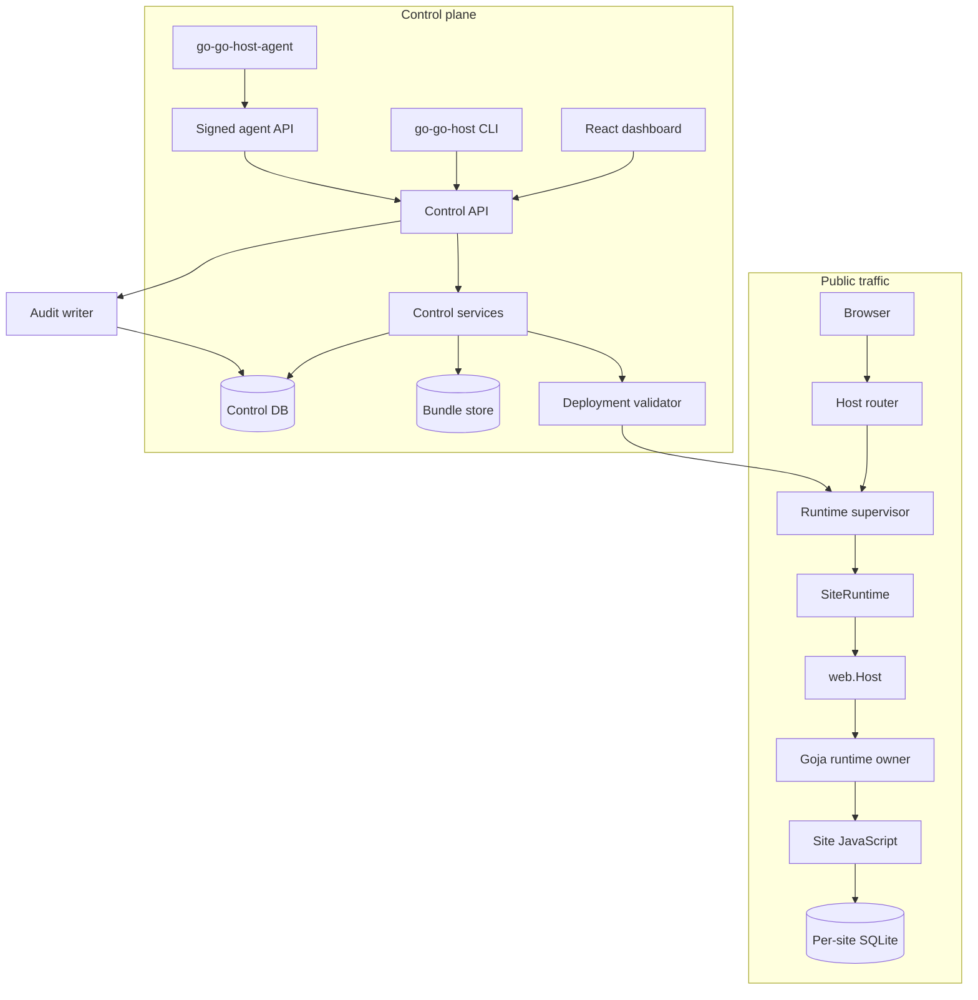
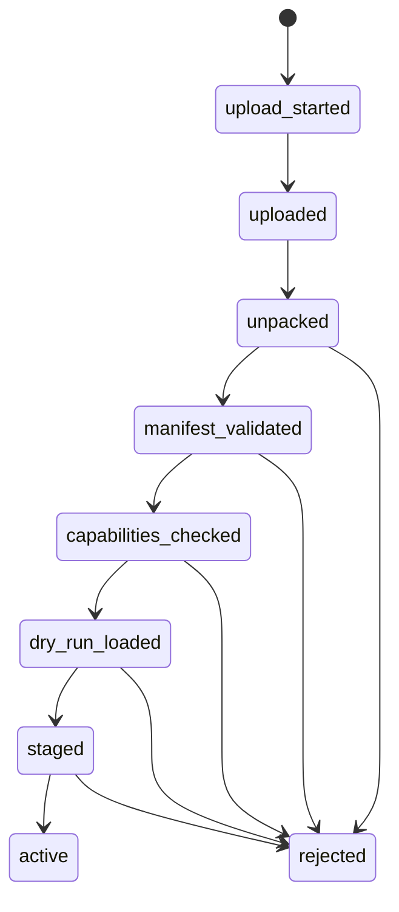

# go-go-host v1 hosting platform intern design and implementation guide

## Executive summary

go-go-host v1 is a hosting platform for small server-rendered sites written in JavaScript and executed inside Go via Goja. The existing `goja-site` prototype already proves the runtime idea: Go owns the HTTP server, SQLite connection, route registry, module registration, and lifecycle, while JavaScript registers routes and returns UI values. v1 turns that prototype into a product with users, organizations, sites, deployments, agent deploys, audit logs, runtime status, and an operator dashboard.

The most important design choice is to copy/refactor the runtime shape rather than reinvent it. The current `app.Server` owns a config, SQLite DB, Goja runtime, `web.Host`, and HTTP server (`2026-05-03--goja-hosting-site/pkg/app/server.go:25-32`). That is exactly the object a hosted platform needs per active site. The current `MultiServer` already dispatches by normalized `Host` header into a map of site servers (`pkg/app/multi_server.go:57-69`). v1 should keep the same public-request mental model but replace static YAML configuration with a database-backed control plane and a runtime supervisor.

The second major choice is to separate product authorization from authentication. Human users may authenticate with OIDC/Keycloak later, but the platform should store organizations, memberships, site grants, agent keys, deploy runs, and audit rows itself. Existing Agent Enroll code demonstrates the machine identity pattern we want: an agent signs a canonical request, the server verifies timestamp, nonce, key status, and Ed25519 signature, then records the nonce to prevent replay (`2026-05-03--agent-enroll/internal/agent/signature.go:24-70`). Existing run-token code demonstrates the narrowing pattern: a broad agent identity claims a narrow operation and receives a short-lived opaque token (`internal/runs/runs.go:147-187`).

The dashboard should be a proper React application, not a server-rendered afterthought. Use Vite, React, Redux Toolkit Query, Storybook, and `@go-go-golems/os-core`. The reference app already uses `@go-go-golems/os-core`, React 19, `@reduxjs/toolkit`, Storybook, and Vite in `package.json` (`npm-go-go-os-test/package.json:6-35`), imports the OS theme at app startup (`src/main.tsx:1-7`), and demonstrates RTK Query endpoints, tags, hooks, and a provider (`examples/03-rtk-query-control-panel/src/services/controlPanelApi.ts:56-123`, `src/app/store.ts:1-17`). For go-go-host, these patterns become real API calls against `/api/v1/*` instead of `fakeBaseQuery()`.

The third major choice is to borrow `vm-system`'s runtime-management vocabulary, not necessarily its implementation wholesale. `vm-system` has a clean split between transport-agnostic orchestration (`vmcontrol.Core`), runtime ports, persistent store ports, and HTTP transport (`vm-system/pkg/vmcontrol/core.go:9-31`, `pkg/vmcontrol/ports.go:9-51`, `pkg/vmtransport/http/server.go:15-53`). It also models capabilities, startup files, sessions, executions, and runtime summaries in SQLite (`pkg/vmstore/vmstore_migrations.go:5-91`). go-go-host should adapt those ideas as `RuntimeSupervisor`, `RuntimeRegistry`, `DeploymentValidator`, `SiteRuntime`, and `CapabilityPolicy`.

## Problem statement and scope

The proposal asks for the first v1 of `go-go-host`: a hosting platform that can run many Goja sites, let humans manage sites through a dashboard, let humans and agents deploy new versions, and expose enough runtime status to operate the service. The system must be understandable to a new intern and refactor-friendly, because the runtime is being copied from a prototype into a new service.

### What v1 must do

- Accept a user-facing concept of **organization**, **site**, **deployment**, **runtime instance**, **agent**, **agent key**, and **audit event**.
- Serve public requests by `Host` header to the active runtime for one site.
- Store immutable deployment bundles and activation history.
- Validate deployment manifests, bundle paths, sizes, and requested capabilities before activation.
- Run one Goja runtime per active site, with per-site SQLite and scoped native modules.
- Provide a control API for the dashboard and CLI.
- Provide a React/RTK Query/Storybook dashboard using `@go-go-golems/os-core`.
- Support an agent deployment flow based on Ed25519 signed requests and short-lived deploy/upload tokens.
- Keep enough runtime state and events for debugging, rollback, and audit.

### What v1 should explicitly not promise

- Full Node compatibility.
- Arbitrary untrusted-code public cloud isolation.
- Unrestricted filesystem access from JavaScript.
- Unrestricted network egress from JavaScript.
- Billing, multi-region hosting, custom-domain TLS automation, or arbitrary npm package execution.
- MicroVM isolation in the first milestone.

The in-process Goja model is useful and fast, but it is not a strong tenant security boundary. The service can still be valuable for trusted beta users and internal tools if all host capabilities are mediated and the design leaves room for future worker-process or microVM isolation.

## Intern mental model

Keep four systems separate:



Authentication answers: **who is speaking?** Authorization answers: **may this identity perform this operation on this resource?** Deployment answers: **which code version is active?** Runtime answers: **how does a public HTTP request become a response?**

An intern debugging any bug should ask:

1. Which actor is involved: public visitor, human user, agent, deploy run, or platform admin?
2. Which row grants authority: membership, site grant, agent grant, or deploy token?
3. Which site and deployment are targeted?
4. Which runtime instance is serving the request?
5. Which host capability is the JavaScript code using?
6. Which audit event should exist if the operation succeeded?

## Current-state source analysis

### Existing goja-site runtime

`goja-site`'s `Server` is the seed for `SiteRuntime`. It owns the database, runtime, route host, and HTTP server (`pkg/app/server.go:25-32`). `NewServer` normalizes defaults, creates the SQLite DB, constructs a `web.Host`, wraps the DB with `dbguard`, registers preconfigured `database` and `db` modules, enables native module middleware, creates a Goja runtime, injects the runtime owner into the host, and loads scripts (`server.go:34-95`).

Important details for v1:

- The database module is created with `WithPreconfiguredDB` and `WithConfigureEnabled(false)` (`server.go:60-68`). That is the correct hosted behavior: JavaScript should not choose an arbitrary DSN.
- The current runtime enables `fs`, `path`, `time`, and `timer` middleware (`server.go:70-76`). v1 should not expose unrestricted `fs` to untrusted sites by default.
- Script loading enters the runtime through the owner (`server.go:148-166`). This is necessary because Goja runtimes are not goroutine-safe.
- `Close` shuts down HTTP, runtime, and DB (`server.go:128-145`). v1 needs the same cleanup path during activation swaps and site shutdown.

`web.Host` is the HTTP bridge. It keeps a route registry, renderer, runtime owner, sessions, and static mounts (`pkg/web/host.go:24-31`). On each request it serves static mounts first, matches a route, creates request/response DTOs, then calls the JavaScript handler through `h.owner.Call` (`host.go:46-94`). If the handler returns a string it sends text; otherwise it renders HTML through the configured renderer (`host.go:84-91`). v1 should preserve this bridge but add platform context: request ID, site ID, deployment ID, org ID, and runtime limits.

`Registry` is intentionally small: routes are `{method, pattern, handler}`, protected by a mutex (`pkg/web/route_registry.go:10-27`), and matching supports exact segments, `:params`, and `*` (`route_registry.go:29-94`). This is enough for v1. Do not add a complex router until there is a concrete product need.

`MultiServer` proves host dispatch. It builds a map from host name to `*Server`, and `ServeHTTP` normalizes `r.Host` and delegates to the target site (`pkg/app/multi_server.go:13-31`, `57-69`). The limitation is that this map is fixed at startup and sourced from YAML. v1 should replace it with an atomic dynamic map owned by a runtime supervisor.

`MultiConfig` proves naming and storage defaults. It validates site names, derives hostnames from base domain, normalizes hosts, and derives per-site DB paths under `DataDir` (`pkg/app/multi_config.go:14-31`, `54-116`). v1 should turn these rules into API validation and database constraints.

### Existing database guard

`dbguard.Guard` tracks a DB path, size limits, write count, cleanup callback, stats, and last result (`pkg/dbguard/guard.go:13-31`). It can check limits before and after exec (`guard.go:93-130`), measure size, call a JavaScript cleanup callback when over limit (`guard.go:132-212`), and remember results. This is a useful seed for quotas.

In v1, the host should own the policy. JavaScript may register a cleanup callback, but the platform decides `soft_max_bytes`, `hard_max_bytes`, write throttling, and failure behavior from `site_quotas`. The dashboard should display `Stats()` and `LastResult()` for each site.

### Existing machine identity and run-token pattern

Agent Enroll's `CanonicalString` hashes the body and signs `METHOD`, `path`, `sha256(body)`, timestamp, and nonce (`internal/agent/signature.go:24-27`). Verification checks headers, parses timestamp, enforces freshness, loads an active key for an active agent, verifies Ed25519, and inserts the nonce (`signature.go:29-70`). This is the exact pattern for `go-go-host-agent deploy`.

Agent Enroll's run service is the token narrowing model. It checks a grant row before issuing a run (`internal/runs/runs.go:124-130`), creates a run ID, opaque token, token ID, 15-minute expiry, stores a hashed token, records usage, and inserts an audit event (`runs.go:147-180`). For go-go-host, rename the nouns:

| Agent Enroll | go-go-host |
|---|---|
| board | site |
| task | deployment upload |
| run | deploy run |
| run token | upload token / deploy token |
| can_claim | can_deploy |

### Existing Wish Git scoped-delegation and boundary-enforcement pattern

After the local `2026-05-01--wish-git` checkout was added to the workspace, it became possible to replace the earlier proposal-only Wish Git references with concrete source evidence. The relevant lesson is not that go-go-host v1 should become Git-first. The lesson is that Wish Git cleanly separates a delegated operation record from the final mutation boundary, then checks scope again where the write actually happens.

`internal/policy/authorize.go` defines a compact `RunContext` with run ID, user ID, repository ID, allowed actions, allowed refs, allowed paths, expiry, and status (`2026-05-01--wish-git/internal/policy/authorize.go:5-15`). Authorization is deliberately boring: `AllowsAction` requires active status and non-expiry before checking the action allowlist (`authorize.go:17-22`), `AllowsRef` checks ref globs (`authorize.go:24-31`), and `AllowsPath` denies empty path scopes and checks path globs (`authorize.go:33-43`). The glob helper supports exact matches, `filepath.Match`, and a recursive `/**` suffix convention (`internal/policy/patterns.go:8-20`).

For go-go-host, copy this simplicity into deployment policy. A `DeployRunContext` should look like:

```go
type DeployRunContext struct {
    RunID           string
    ActorType       string // user or agent
    ActorID         string
    SiteID          string
    AllowedActions  []string // site.deploy, site.rollback
    AllowedChannels []string // production, preview/*
    AllowedPaths    []string // scripts/**, assets/**, go-go-host.json
    ExpiresAt       time.Time
    Status          string // active, completed, revoked, expired
}
```

The hosting equivalent of Wish Git's ref/path checks is:

```go
func AllowsDeployAction(run DeployRunContext, action string, now time.Time) bool {
    return run.Status == "active" && now.Before(run.ExpiresAt) && contains(run.AllowedActions, action)
}

func AllowsChannel(run DeployRunContext, channel string) bool {
    return matchesAny(run.AllowedChannels, channel)
}

func AllowsBundlePath(run DeployRunContext, path string) bool {
    if len(run.AllowedPaths) == 0 { return false }
    return matchesAny(run.AllowedPaths, path)
}
```

`internal/githook/pre_receive.go` is the final-boundary enforcement reference. It parses Git pre-receive updates (`pre_receive.go:26-37`), rejects deletes when configured (`pre_receive.go:39-43`), rejects refs outside scope (`pre_receive.go:44-46`), optionally rejects non-fast-forward updates (`pre_receive.go:47-49`), computes changed paths, and rejects any changed path outside the allowlist (`pre_receive.go:50-60`). The deployment validator should mirror this as a bundle pre-receive hook: even if the API created a deploy run, the bundle validator must independently reject forbidden files, forbidden channels, expired runs, and disallowed capabilities before storing an activatable deployment.

Wish Git's API also gives a useful human-delegation shape. `handleCreateRun` receives repo, purpose, TTL, allowed actions, refs, and paths (`internal/api/agent_runs.go:21-28`), verifies the current user's repository permission before creating the run (`agent_runs.go:58-67`), caps/defaults TTL to at most 3600 seconds (`agent_runs.go:68-70`), defaults refs and paths if omitted (`agent_runs.go:71-80`), creates the run row, and audits `agent_run.create` (`agent_runs.go:81-87`). go-go-host should implement the same flow for human-created deploy runs and agent-created deploy runs, with site permissions replacing repository permissions.

The SSH certificate endpoint is less directly reusable for bundle-upload v1, but it demonstrates the same narrowing principle. It only issues a certificate when the run is active, unexpired, and owned by the current user (`internal/api/ssh_certs.go:63-67`), signs with a max TTL (`ssh_certs.go:73-83`), stores certificate metadata, and audits `ssh_certificate.issue` (`ssh_certs.go:87-94`). If go-go-host later adds Git remote deploys, this certificate path is the strongest starting point.

Wish Git's initial schema confirms the product data model direction: users are keyed by OIDC issuer/subject (`internal/store/migrations/001_initial_schema.sql:3-12`), organizations and members are local app rows (`001_initial_schema.sql:14-26`), repo permissions are local policy rows (`001_initial_schema.sql:39-45`), agent runs carry allowed actions/refs/paths and expiry (`001_initial_schema.sql:47-60`), and audit events record actor, run, resource, event type, IP, user agent, metadata, and time (`001_initial_schema.sql:75-85`). The go-go-host schema should keep this local-authorization shape and rename repo concepts to site/deployment concepts.

### go-go-goja module surface

The shared `go-go-goja` modules are useful but not all safe by default.

The `express` registrar exposes `app.get`, `app.post`, `app.put`, `app.patch`, `app.delete`, `app.all`, and `app.static`; each route registers a Goja callable on the Go host (`go-go-goja/modules/express/express.go:53-79`). This should stay as the friendly site authoring API.

The database module supports a preconfigured mode and explicitly refuses `configure()` when disabled (`go-go-goja/modules/database/database.go:31-39`, `153-166`). This is a strong capability boundary and should be mandatory for hosted sites.

The `fs` module exposes read, write, mkdir, unlink, rename, copy, rm, and synchronous variants (`go-go-goja/modules/fs/fs.go:40-63`, `82-184`). This is too broad for default hosting. v1 should either omit `fs`, or replace it with a scoped `assets` module that only reads deployment assets under the unpacked bundle directory.

The `exec` module runs arbitrary commands via `os/exec` and documents itself as trusted-runtime functionality (`go-go-goja/modules/exec/exec.go:11-49`). It must never be exposed to hosted sites in v1.

### vm-system pieces worth reusing

`vm-system` separates concerns well:

- `vmcontrol.Core` is transport-agnostic orchestration and wires templates, sessions, executions, and runtime registry (`vm-system/pkg/vmcontrol/core.go:9-31`). go-go-host should copy this package shape as `internal/control.Core`.
- `ports.go` defines storage and runtime interfaces (`pkg/vmcontrol/ports.go:9-51`). go-go-host should use ports to keep tests independent from Postgres and Goja runtime startup.
- `RuntimeRegistry.Summary` returns active in-memory runtime visibility (`pkg/vmcontrol/runtime_registry.go:17-27`). go-go-host needs this for site runtime health.
- `vmdaemon.App` opens the store, reconciles stale runtime state on startup, wires an HTTP server, and supports graceful shutdown (`pkg/vmdaemon/app.go:16-52`, `55-91`, `102-130`). go-go-host needs the same startup reconciliation: any persisted `runtime_status=starting|ready` from a previous process should become `stopped` or `unknown` before supervisor activation.
- `vmstore` models capability allowlists and startup files (`pkg/vmstore/vmstore_migrations.go:26-45`). go-go-host should map that to site capability policies and deployment startup scripts.
- `vmsession.SessionManager` keeps active runtime sessions in a map guarded by an RW mutex, creates persistent session rows, marks failures, loads configured libraries, and runs startup files (`pkg/vmsession/session.go:23-43`, `54-167`). go-go-host's supervisor should use the map/lifecycle pattern, but use the `engine.Runtime` owner model from `goja-site`, not raw `goja.New()`.

### Dashboard reference app

The npm reference app already demonstrates the dashboard stack:

- Vite/TypeScript/Storybook scripts and dependencies are in `package.json` (`package.json:6-35`).
- The app imports `@go-go-golems/os-core/theme`, `desktop-theme-macos1`, and widget themes at startup (`src/main.tsx:1-7`).
- The root app wraps the RTK Query example in a Redux provider when selected (`src/ExampleWorkspaceApp.tsx:53-56`).
- The store installs an RTK Query reducer and middleware (`examples/03-rtk-query-control-panel/src/app/store.ts:1-17`).
- The API file defines typed endpoints, tags, query hooks, and mutation hooks (`controlPanelApi.ts:56-123`).
- The control panel UI uses hooks and OS components such as `Btn`, `Chip`, `ProgressBar`, `TabControl`, `WidgetToolbar`, and a shell component (`ControlPanelApp.tsx:1-20`, `24-101`).

For go-go-host, keep the same structure but replace fake endpoints with `fetchBaseQuery({ baseUrl: '/api/v1' })`.

## Proposed architecture



### Backend package layout

Use boring package names that match responsibilities:

```text
go-go-host/
  cmd/go-go-hostd/               # server daemon
  cmd/go-go-host/                # human CLI
  cmd/go-go-host-agent/          # agent CLI
  internal/config/               # config loading and defaults
  internal/control/              # transport-agnostic Core and services
  internal/control/ports.go      # StorePort, RuntimePort, BlobStorePort
  internal/store/                # migrations and DB implementations
  internal/httpapi/              # /api/v1 handlers, auth middleware
  internal/agentauth/            # Ed25519 request verification
  internal/deploy/               # bundle unpack/validate/store/activate
  internal/runtime/              # SiteRuntime and RuntimeSupervisor
  internal/audit/                # append-only audit events
  internal/webadmin/             # embedded React dashboard assets
  web/admin/                     # Vite React dashboard source
```

Do not let `internal/httpapi` directly manipulate Goja runtimes or SQL rows. It should parse requests, authenticate, call `control.Core`, and serialize responses. That mirrors `vm-system`'s transport/core split.

### Core service interfaces

Pseudocode:

```go
type Core struct {
    Orgs        *OrgService
    Sites       *SiteService
    Deployments *DeploymentService
    Agents      *AgentService
    Runtimes    *RuntimeService
    Audit       *audit.Writer
}

type StorePort interface {
    UserStore
    OrgStore
    SiteStore
    DeploymentStore
    AgentStore
    AuditStore
    RuntimeStateStore
}

type RuntimeSupervisorPort interface {
    GetByHost(host string) (*runtime.SiteRuntime, bool)
    Activate(ctx context.Context, siteID, deploymentID string) error
    Stop(ctx context.Context, siteID string) error
    Restart(ctx context.Context, siteID string) error
    Summary(ctx context.Context) RuntimeSummary
}

type BlobStorePort interface {
    PutBundle(ctx context.Context, siteID, deploymentID string, r io.Reader) (BundleRef, error)
    OpenBundle(ctx context.Context, ref BundleRef) (io.ReadCloser, error)
    UnpackTo(ctx context.Context, ref BundleRef, dst string) error
}
```

The intern should notice that these interfaces express product operations, not implementation details. That makes tests simple: fake the store and supervisor for control-service tests, use real runtime only in integration tests.

## Data model

Use Postgres for a serious hosted service. SQLite can be used for local development if migrations are compatible, but do not design around single-process control-plane writes.

### Control-plane tables

```sql
users(
  id uuid primary key,
  issuer text not null,
  subject text not null,
  email text,
  display_name text,
  created_at timestamptz not null,
  last_login_at timestamptz,
  unique(issuer, subject)
);

orgs(id uuid primary key, slug text unique not null, name text not null, created_at timestamptz not null);
memberships(org_id uuid, user_id uuid, role text not null, created_at timestamptz not null,
  primary key(org_id, user_id));

sites(
  id uuid primary key,
  org_id uuid not null references orgs(id),
  slug text not null,
  name text not null,
  primary_host text unique not null,
  status text not null,
  active_deployment_id uuid,
  created_at timestamptz not null,
  unique(org_id, slug)
);

site_domains(id uuid primary key, site_id uuid not null references sites(id), hostname text unique not null, status text not null, verified_at timestamptz);
site_quotas(site_id uuid primary key, bundle_max_bytes bigint, db_soft_max_bytes bigint, db_hard_max_bytes bigint, request_timeout_ms int);
site_capabilities(site_id uuid, capability text, enabled boolean, config_json jsonb not null default '{}', primary key(site_id, capability));

deployments(
  id uuid primary key,
  site_id uuid not null references sites(id),
  version int not null,
  status text not null,
  bundle_ref text not null,
  unpacked_path text,
  manifest_json jsonb not null,
  validation_json jsonb not null default '{}',
  created_by_type text not null,
  created_by_id text not null,
  created_at timestamptz not null,
  activated_at timestamptz,
  unique(site_id, version)
);

deploy_runs(
  id uuid primary key,
  site_id uuid not null references sites(id),
  agent_id uuid,
  requested_by_user_id uuid,
  status text not null,
  scopes text[] not null,
  upload_token_hash text,
  expires_at timestamptz not null,
  created_at timestamptz not null,
  finished_at timestamptz
);

agents(id uuid primary key, org_id uuid not null references orgs(id), name text not null, status text not null, created_by_user_id uuid, created_at timestamptz not null, last_seen_at timestamptz);
agent_keys(id uuid primary key, agent_id uuid not null references agents(id), public_key text not null, status text not null, created_at timestamptz not null, revoked_at timestamptz);
agent_site_grants(agent_id uuid, site_id uuid, can_deploy boolean, can_rollback boolean, allowed_channels text[], allowed_paths text[], expires_at timestamptz, primary key(agent_id, site_id));
agent_nonces(agent_id uuid, nonce text, seen_at timestamptz not null, primary key(agent_id, nonce));

audit_log(id uuid primary key, org_id uuid, actor_type text not null, actor_id text not null, action text not null, resource_type text not null, resource_id text not null, metadata_json jsonb not null default '{}', created_at timestamptz not null);
```

### Site storage

Each site gets:

```text
<data-dir>/sites/<site-id>/
  db/app.sqlite                 # per-site application DB
  deployments/<deployment-id>/  # unpacked immutable deployment
  logs/                         # optional local runtime logs in dev
```

The platform never lets JavaScript choose this path. JavaScript receives a preconfigured DB module and safe asset/static mounts only.

## Runtime design

### SiteRuntime

Pseudocode:

```go
type SiteRuntime struct {
    SiteID       string
    OrgID        string
    DeploymentID string
    Hosts        []string
    BundlePath   string
    DBPath       string
    Capabilities CapabilitySet

    db      *sql.DB
    guard   *dbguard.Guard
    runtime *engine.Runtime
    host    *web.Host

    startedAt time.Time
    status    atomic.Value // RuntimeStatus
}

func NewSiteRuntime(ctx context.Context, spec RuntimeSpec) (*SiteRuntime, error) {
    db := openSiteDB(spec.DBPath)
    guard := dbguard.New(db, spec.DBPath)
    metered := dbguard.NewMeteredDB(db, guard)

    host := web.NewHost(web.HostOptions{
        Dev: spec.Dev,
        Renderer: uidsl.RenderAny,
    })

    modules := BuildModules(spec.Capabilities, metered, guard, host)
    factory := engine.NewBuilder().WithModules(modules.Native...).WithRuntimeModuleRegistrars(modules.Registrars...).Build()
    rt := factory.NewRuntime(ctx)
    host.SetRuntime(rt.Owner)

    sr := &SiteRuntime{...}
    if err := sr.LoadScripts(ctx, spec.BundlePath); err != nil { sr.Close(ctx); return nil, err }
    return sr, nil
}
```

This deliberately mirrors `goja-site.NewServer`, but removes process-level HTTP ownership. The top-level daemon owns the public listener; `SiteRuntime` only exposes an `http.Handler`.

### RuntimeSupervisor

Pseudocode:

```go
type RuntimeSupervisor struct {
    mu       sync.RWMutex
    bySiteID map[string]*SiteRuntime
    byHost   map[string]*SiteRuntime
    store    StorePort
    blobs    BlobStorePort
}

func (s *RuntimeSupervisor) Activate(ctx context.Context, siteID, deploymentID string) error {
    spec, err := s.store.RuntimeSpec(ctx, siteID, deploymentID)
    if err != nil { return err }

    next, err := NewSiteRuntime(ctx, spec)
    if err != nil {
        s.store.MarkRuntimeFailed(ctx, siteID, deploymentID, err.Error())
        return err
    }

    if err := next.HealthCheck(ctx); err != nil {
        next.Close(ctx)
        return err
    }

    s.mu.Lock()
    old := s.bySiteID[siteID]
    s.bySiteID[siteID] = next
    for _, h := range next.Hosts { s.byHost[normalizeHost(h)] = next }
    s.mu.Unlock()

    if old != nil { go old.GracefulClose(30 * time.Second) }
    s.store.MarkRuntimeReady(ctx, siteID, deploymentID)
    return nil
}

func (s *RuntimeSupervisor) ServeHTTP(w http.ResponseWriter, r *http.Request) {
    host := normalizeHost(r.Host)
    s.mu.RLock()
    rt := s.byHost[host]
    s.mu.RUnlock()
    if rt == nil { http.NotFound(w, r); return }
    rt.ServeHTTP(w, withPlatformContext(r, rt))
}
```

Activation should always build the new runtime before swapping the map. This avoids taking down a working site because a new deployment fails to load.

## Deployment model

A deployment is immutable. Activation changes which deployment is live; it does not mutate the deployment bundle.

### Bundle format

```text
site.tar.gz
  go-go-host.json
  scripts/app.js
  assets/style.css
  assets/logo.svg
```

Manifest:

```json
{
  "runtime": "go-go-host/goja-site-v1",
  "entry": "scripts",
  "assets": "assets",
  "routesSmokeTest": "/",
  "permissions": {
    "database": true,
    "assetsRead": true,
    "timers": true,
    "network": []
  },
  "limits": {
    "maxRequestMs": 2000,
    "maxDbBytes": 52428800
  }
}
```

The manifest requests capabilities; it does not grant them. The host intersects requested permissions with site policy.

### Validation pipeline



Pseudocode:

```go
func ValidateDeployment(ctx context.Context, input ValidateInput) (ValidationReport, error) {
    report := ValidationReport{}
    files := listArchive(input.Bundle)
    rejectAbsoluteOrDotDot(files)
    enforceFileCountAndSize(files, input.Quota)

    manifest := readManifest(files, "go-go-host.json")
    validateManifestSchema(manifest)

    requested := ParseCapabilities(manifest.Permissions)
    allowed := input.SitePolicy.Capabilities
    effective, denied := allowed.Intersect(requested)
    if len(denied) > 0 { return report.Reject("capability denied", denied) }

    unpacked := unpackImmutable(input.Bundle, input.DeploymentID)
    spec := RuntimeSpec{BundlePath: unpacked, Capabilities: effective, DryRun: true}
    rt, err := NewSiteRuntime(ctx, spec)
    if err != nil { return report.Reject("script load failed", err) }
    defer rt.Close(ctx)

    if manifest.RoutesSmokeTest != "" { smokeGET(rt, manifest.RoutesSmokeTest) }
    return report.Accept(effective), nil
}
```

## API reference sketch

All dashboard and CLI endpoints live under `/api/v1`. Public site traffic is routed by host and path outside `/api/v1`.

### Human/session endpoints

```http
GET  /api/v1/me
POST /api/v1/logout
```

Response:

```json
{
  "user": { "id": "usr_...", "email": "intern@example.com" },
  "orgs": [{ "id": "org_...", "slug": "parc", "role": "org_owner" }]
}
```

### Site endpoints

```http
GET    /api/v1/orgs/{org_id}/sites
POST   /api/v1/orgs/{org_id}/sites
GET    /api/v1/sites/{site_id}
PATCH  /api/v1/sites/{site_id}
DELETE /api/v1/sites/{site_id}
GET    /api/v1/sites/{site_id}/runtime
POST   /api/v1/sites/{site_id}/runtime/restart
```

Create site request:

```json
{ "slug": "trail-notes", "name": "Trail Notes" }
```

Runtime response:

```json
{
  "siteId": "site_123",
  "deploymentId": "dep_456",
  "status": "ready",
  "hosts": ["trail-notes.localhost"],
  "startedAt": "2026-05-11T21:00:00Z",
  "requestsTotal": 1234,
  "lastError": null
}
```

### Deployment endpoints

```http
GET  /api/v1/sites/{site_id}/deployments
POST /api/v1/sites/{site_id}/deployments
GET  /api/v1/deployments/{deployment_id}
POST /api/v1/deployments/{deployment_id}/activate
POST /api/v1/deployments/{deployment_id}/rollback-to
```

`POST /deployments` accepts a multipart bundle or returns an upload URL, depending on first implementation preference. For v1 local development, multipart is simpler.

### Agent endpoints

```http
POST /api/v1/orgs/{org_id}/agents
GET  /api/v1/orgs/{org_id}/agents
POST /api/v1/agents/{agent_id}/keys
POST /api/v1/agents/{agent_id}/grants
POST /api/v1/agent/deploy-runs       # signed request
PUT  /api/v1/agent/deploy-runs/{run_id}/bundle
```

Signed request headers:

```text
X-Agent-Id: agt_...
X-Key-Id: key_...
X-Timestamp: 2026-05-11T21:00:00Z
X-Nonce: random-128-bit-string
X-Signature: base64-ed25519-signature
```

Canonical string:

```text
METHOD\nPATH\nHEX_SHA256_BODY\nTIMESTAMP\nNONCE
```

This intentionally matches the existing Agent Enroll pattern.

## CLI command architecture: use Glazed commands

The implementation should use the Glazed command structure for both command-line binaries: `go-go-host` for humans and `go-go-host-agent` for headless agents. Do not build these CLIs as ad-hoc Cobra commands. Cobra can still provide the root and group tree, but individual verbs should be Glazed commands with typed settings structs, command descriptions, output schemas, and `RunIntoGlazeProcessor` implementations.

This matters because go-go-host commands naturally produce tabular and structured output: sites, deployments, agents, runs, runtime status, validation reports, audit events, and quota rows. Glazed gives the project consistent `--output`, `--fields`, help, logging, YAML/JSON/table output, and future scripting behavior from the start.

### Root command requirements

Each CLI root should follow the standard Glazed root pattern:

```go
rootCmd := &cobra.Command{
    Use:   "go-go-host",
    Short: "Manage go-go-host sites, deployments, agents, and runtime state",
    PersistentPreRunE: func(cmd *cobra.Command, args []string) error {
        return logging.InitLoggerFromCobra(cmd)
    },
}

if err := logging.AddLoggingSectionToRootCommand(rootCmd, "go-go-host"); err != nil {
    return err
}

helpSystem := help.NewHelpSystem()
if err := doc.AddDocToHelpSystem(helpSystem); err != nil {
    return err
}
help_cmd.SetupCobraRootCommand(helpSystem, rootCmd)
```

`go-go-host-agent` should use the same pattern with app name `go-go-host-agent`. The root command owns logging and help setup. Child commands should not create their own help systems.

### Folder layout for Glazed command groups

Mirror the command tree in folders:

```text
cmd/go-go-host/
  main.go
  root.go
  doc/                         # embedded help docs
  cmds/
    orgs/root.go
    orgs/list.go
    sites/root.go
    sites/list.go
    sites/create.go
    deployments/root.go
    deployments/list.go
    deployments/activate.go
    deploy/root.go             # deploy ./site can be top-level or group command
    agents/root.go
    audit/root.go

cmd/go-go-host-agent/
  main.go
  root.go
  doc/
  cmds/
    keygen.go
    enroll.go
    deploy.go
    status.go
```

For every command:

1. Define a command struct embedding `*cmds.CommandDescription`.
2. Define a settings struct with `glazed:"..."` tags.
3. Build the description with `cmds.NewCommandDescription`, `cmds.WithFlags`, `cmds.WithArguments`, and `cmds.WithSections`.
4. Add `settings.NewGlazedSchema()` and `cli.NewCommandSettingsSection()`.
5. Decode with `vals.DecodeSectionInto(schema.DefaultSlug, settings)`.
6. Emit rows with `types.NewRow` and `gp.AddRow(ctx, row)`.
7. Build Cobra wiring via `cli.BuildCobraCommandFromCommand`.

### Example command skeleton

```go
type SitesListCommand struct {
    *cmds.CommandDescription
    ClientFactory ClientFactory
}

type SitesListSettings struct {
    Org string `glazed:"org"`
}

func NewSitesListCommand(cf ClientFactory) (*SitesListCommand, error) {
    glazedSection, err := settings.NewGlazedSchema()
    if err != nil { return nil, err }
    commandSettingsSection, err := cli.NewCommandSettingsSection()
    if err != nil { return nil, err }

    desc := cmds.NewCommandDescription(
        "list",
        cmds.WithShort("List sites in an organization"),
        cmds.WithLong(`List sites visible to the current user.

Examples:
  go-go-host sites list --org parc
  go-go-host sites list --org parc --output json`),
        cmds.WithFlags(
            fields.New("org", fields.TypeString, fields.WithHelp("Organization slug or ID"), fields.WithRequired(true)),
        ),
        cmds.WithSections(glazedSection, commandSettingsSection),
    )
    return &SitesListCommand{CommandDescription: desc, ClientFactory: cf}, nil
}

func (c *SitesListCommand) RunIntoGlazeProcessor(ctx context.Context, vals *values.Values, gp middlewares.Processor) error {
    s := &SitesListSettings{}
    if err := vals.DecodeSectionInto(schema.DefaultSlug, s); err != nil { return err }

    client, err := c.ClientFactory.FromConfig()
    if err != nil { return err }
    sites, err := client.ListSites(ctx, s.Org)
    if err != nil { return err }

    for _, site := range sites {
        if err := gp.AddRow(ctx, types.NewRow(
            types.MRP("id", site.ID),
            types.MRP("slug", site.Slug),
            types.MRP("host", site.PrimaryHost),
            types.MRP("status", site.Status),
            types.MRP("active_deployment_id", site.ActiveDeploymentID),
        )); err != nil { return err }
    }
    return nil
}
```

### Output conventions

- List commands emit one row per object.
- Detail commands emit one row with stable field names, plus optional nested JSON fields when appropriate.
- Mutation commands emit the mutated object or an operation result row with `status`, `id`, and relevant URLs/commands.
- Deployment validation commands should default to YAML or JSON because validation reports are nested.
- Long-running or polling commands should use an explicit `--watch` or `--stream` flag and default to bounded execution unless the user opts into streaming.

## Dashboard design

The updated proposal now makes a stronger distinction between two dashboard surfaces: a **user dashboard** for normal organization users and developers, and a **platform admin console** for installation operators. This changes the implementation plan. The dashboard is no longer one generic admin UI; it is a role-gated product surface with two different audiences, navigation models, and API scopes.

### Two dashboard surfaces

| Dashboard | Audience | Scope | Primary questions |
|---|---|---|---|
| User dashboard | Org owners, org developers, org viewers | Only orgs/sites/resources the user may access | "How do I create a site, deploy it, manage agents, inspect usage, and debug my own apps?" |
| Platform admin console | Platform operators / `platform_admin` users | Whole installation | "Is the host healthy, who is using it, are quotas/abuse/runtimes under control, and what global policy must change?" |

For v1 these can live in one embedded React/Vite SPA, but they should be separate route groups and separate navigation sections:

```text
/app/*          user dashboard, scoped by current user memberships
/admin/*        platform admin console, visible only to platform_admin
```

The same RTK Query API client can serve both surfaces, but endpoint names should encode scope. Prefer `listOrgSites`, `getSiteRuntime`, and `createDeployRun` for user-scope operations; prefer `adminListSites`, `adminRuntimeSummary`, and `adminUpdateQuotaPolicy` for platform-scope operations. This makes accidental cross-scope calls easier to spot in review.

### User dashboard research from Agent Enroll

The updated proposal points to the Agent Enroll dashboard as the closest existing user-workspace UI. The source is available locally under `2026-05-03--agent-enroll/web/dashboard/src`.

Important patterns:

- `App.tsx` wraps pages in `AppShell`, checks the browser session with `useBrowserSession`, and protects routes with `RequireSession` (`web/dashboard/src/App.tsx:15-52`).
- The route table is small and org-scoped: org home, board detail, task detail, agents, usage, and audit (`App.tsx:20-29`). go-go-host should map this to org sites, site detail, deployments, agents, usage, audit, and members.
- `AgentsPage.tsx` demonstrates the user-facing agent workflow: list agents, poll active runs every 15 seconds, create an enrollment token, show a one-time token dialog, revoke an agent through confirmation, and invalidate data through RTK Query mutations (`pages/AgentsPage.tsx:14-87`).
- `EnrollmentTokenPanel.tsx` combines `SecretRevealBox` and `CommandCopyBox` to show a secret once and give the user copyable CLI commands (`components/organisms/EnrollmentTokenPanel.tsx:1-12`).
- `SecretRevealBox.tsx` explicitly warns that the secret is shown intentionally and requires reveal before copy (`components/molecules/SecretRevealBox.tsx:4-33`).
- `CommandCopyBox.tsx` is the copyable command pattern for onboarding CLI/agent flows (`components/molecules/CommandCopyBox.tsx:4-22`).
- `api/kanbanApi.ts` is a real RTK Query client with `fetchBaseQuery`, bearer-token preparation, typed endpoints, cache tags, and invalidation (`api/kanbanApi.ts:15-117`).

The hosting dashboard should adapt these as:

| Agent Enroll UI concept | go-go-host user dashboard concept |
|---|---|
| Board list/detail | Site list/detail |
| Task/run | Deployment/deploy run |
| Enrollment token | Bot/agent registration token |
| Agent revoke | Revoke deploy bot, keys, and outstanding deploy tokens |
| Usage page | Request, error, DB, bundle, and deployment usage |
| Audit page | Site/deployment/agent/domain/capability audit trail |

### User dashboard pages

The user dashboard should ship before, or at the same time as, the platform admin console because it is the normal product interface. Minimum route sketch:

```tsx
<Route path="/app" element={<RequireSession><OrgRedirect /></RequireSession>} />
<Route path="/app/orgs/:orgId/sites" element={<RequireOrgAccess><SitesPage /></RequireOrgAccess>} />
<Route path="/app/orgs/:orgId/sites/:siteId" element={<RequireSiteAccess><SiteDetailPage /></RequireSiteAccess>} />
<Route path="/app/orgs/:orgId/sites/:siteId/deployments" element={<DeploymentsPage />} />
<Route path="/app/orgs/:orgId/sites/:siteId/deployments/:deploymentId" element={<DeploymentDetailPage />} />
<Route path="/app/orgs/:orgId/sites/:siteId/domains" element={<DomainsPage />} />
<Route path="/app/orgs/:orgId/sites/:siteId/capabilities" element={<CapabilitiesPage />} />
<Route path="/app/orgs/:orgId/agents" element={<AgentsPage />} />
<Route path="/app/orgs/:orgId/bot-tokens" element={<BotTokensPage />} />
<Route path="/app/orgs/:orgId/usage" element={<UsagePage />} />
<Route path="/app/orgs/:orgId/audit" element={<AuditPage />} />
<Route path="/app/orgs/:orgId/members" element={<MembersPage />} />
```

User dashboard workflows:

1. **First login onboarding**: show current user, create/select organization, create first site.
2. **Create site**: choose name, slug, base-domain host, optional starter template.
3. **Deployment instructions**: show copyable `goja-host deploy ./site --site <slug>` command.
4. **Upload deployment**: upload tar/zip bundle, show validation report, activate if allowed.
5. **Rollback deployment**: pick previous validated deployment and activate it.
6. **Manage agents**: create one-time bot/enrollment token, copy `goja-host-agent enroll --token ...`, list/revoke agents.
7. **Grant deploy scope**: choose allowed sites, channels, paths, expiry, and whether rollback is allowed.
8. **Inspect runtime**: show status, active deployment, hosts, request/error counters, last errors.
9. **Inspect usage**: show DB size, bundle size, request count, deployment count, quota warnings.
10. **Audit own resources**: filter by actor, site, deployment, agent, action, and time.

### Platform admin console pages

The platform admin console is for operating the installation, not for normal site authorship. Minimum route sketch:

```tsx
<Route path="/admin" element={<RequirePlatformAdmin><AdminOverviewPage /></RequirePlatformAdmin>} />
<Route path="/admin/users" element={<AdminUsersPage />} />
<Route path="/admin/orgs" element={<AdminOrgsPage />} />
<Route path="/admin/sites" element={<AdminSitesPage />} />
<Route path="/admin/runtimes" element={<AdminRuntimesPage />} />
<Route path="/admin/deployments" element={<AdminDeploymentsPage />} />
<Route path="/admin/agents" element={<AdminAgentsPage />} />
<Route path="/admin/quotas" element={<AdminQuotasPage />} />
<Route path="/admin/domains" element={<AdminDomainsPage />} />
<Route path="/admin/audit" element={<AdminAuditPage />} />
<Route path="/admin/settings" element={<AdminSettingsPage />} />
```

Admin console workflows:

1. **Global overview**: all org count, site count, active runtimes, failed deployments, quota alarms, recent audit events.
2. **User and org support**: inspect users, org memberships, roles, disabled users, last login.
3. **Runtime operations**: list all active runtimes, restart/stop one runtime, inspect last error and active deployment.
4. **Quota policy**: set default quotas, override site quotas, see sites near hard limits.
5. **Deployment moderation**: inspect rejected or suspicious deployments and validation reports.
6. **Domain policy**: manage base domains, custom-domain verification status, and future TLS settings.
7. **Agent abuse response**: revoke agent keys globally or per org/site and invalidate outstanding deploy runs.
8. **Global audit**: filter audit across all tenants; export incident evidence.
9. **Platform settings**: auth issuer, base domain, capability defaults, network egress policy, data retention.

### Frontend package layout

Use one embedded SPA with explicit feature folders for user and admin surfaces:

```text
web/admin/
  package.json
  vite.config.ts
  .storybook/
  src/
    main.tsx
    app/store.ts
    app/router.tsx
    app/AuthGuards.tsx
    services/goGoHostApi.ts
    shell/AppShell.tsx
    features/user/sites/SitesPage.tsx
    features/user/sites/SiteDetailPage.tsx
    features/user/deployments/DeploymentDetailPage.tsx
    features/user/agents/AgentsPage.tsx
    features/user/tokens/BotTokensPage.tsx
    features/user/usage/UsagePage.tsx
    features/user/audit/AuditPage.tsx
    features/admin/overview/AdminOverviewPage.tsx
    features/admin/users/AdminUsersPage.tsx
    features/admin/runtimes/AdminRuntimesPage.tsx
    features/admin/quotas/AdminQuotasPage.tsx
    components/RuntimeBadge.tsx
    components/DeploymentTimeline.tsx
    components/QuotaPanel.tsx
    components/SecretRevealBox.tsx
    components/CommandCopyBox.tsx
```

The UI should use `@go-go-golems/os-core` and Storybook patterns from the npm example, but it should also reuse the Agent Enroll dashboard interaction patterns for user-scoped agent/token workflows.

### RTK Query API slice

```ts
export const goGoHostApi = createApi({
  reducerPath: 'goGoHostApi',
  baseQuery: fetchBaseQuery({ baseUrl: '/api/v1', credentials: 'include' }),
  tagTypes: ['Me', 'Org', 'Site', 'Deployment', 'Runtime', 'Agent', 'DeployRun', 'Usage', 'Audit', 'Admin'],
  endpoints: (builder) => ({
    getMe: builder.query<MeResponse, void>({ query: () => '/me', providesTags: ['Me'] }),
    listOrgSites: builder.query<Site[], string>({
      query: (orgId) => `/orgs/${orgId}/sites`,
      providesTags: (result) => result ? [...result.map(s => ({ type: 'Site' as const, id: s.id })), 'Site'] : ['Site'],
    }),
    createSite: builder.mutation<Site, CreateSiteRequest>({
      query: ({ orgId, ...body }) => ({ url: `/orgs/${orgId}/sites`, method: 'POST', body }),
      invalidatesTags: ['Site', 'Audit'],
    }),
    getSiteRuntime: builder.query<RuntimeStatus, string>({
      query: (siteId) => `/sites/${siteId}/runtime`,
      providesTags: (_r, _e, siteId) => [{ type: 'Runtime', id: siteId }],
    }),
    createBotToken: builder.mutation<BotTokenResponse, CreateBotTokenRequest>({
      query: (body) => ({ url: `/orgs/${body.orgId}/bot-tokens`, method: 'POST', body }),
      invalidatesTags: ['Agent', 'Audit'],
    }),
    activateDeployment: builder.mutation<Deployment, string>({
      query: (deploymentId) => ({ url: `/deployments/${deploymentId}/activate`, method: 'POST' }),
      invalidatesTags: ['Deployment', 'Runtime', 'Site', 'Audit'],
    }),
    adminRuntimeSummary: builder.query<AdminRuntimeSummary, void>({
      query: () => '/admin/runtimes/summary',
      providesTags: ['Admin', 'Runtime'],
    }),
  }),
});
```

### Storybook requirement

Every reusable dashboard component gets stories before integration:

- `RuntimeBadge.stories.tsx`: ready, starting, failed, stopped.
- `DeploymentTimeline.stories.tsx`: active, rejected, rollback candidate.
- `QuotaPanel.stories.tsx`: under soft limit, over soft limit, hard blocked.
- `AgentGrantEditor.stories.tsx`: no grants, single-site deploy, expired grant.
- `SecretRevealBox.stories.tsx`: hidden, revealed, copied, expired token.
- `CommandCopyBox.stories.tsx`: human deploy command, agent enroll command, rollback command.
- `AdminRuntimeTable.stories.tsx`: healthy, degraded, failed runtimes.
- `AdminQuotaPolicyEditor.stories.tsx`: default policy and per-site override.

Use the OS theme imports from the npm example (`src/main.tsx:1-7`) in `.storybook/preview.tsx`.

## Implementation phases

The detailed implementation checklist now lives in `tasks.md` for tracking. This design document keeps the phase intent and ordering so an intern understands why the checklist is split this way.

### Phase 0: Repository scaffold, conventions, and runnable skeleton

Create a runnable daemon, human CLI, agent CLI, config loading, health endpoints, logging, initial `control.Core`, store interfaces, and Makefile targets. No product feature should be implemented before the repository can start, test, and report health.

### Phase 1: Control-plane database, migrations, and core services

Build the durable product model: users, orgs, memberships, platform admins, sites, domains, quotas, capabilities, deployments, deploy runs, agents, keys, grants, nonces, and audit events. Implement local authorization checks before wiring runtime activation.

### Phase 2: Authentication and session foundation

Add dev auth first, then OIDC/JWKS validation and browser/bearer session handling. `GET /api/v1/me` must return user identity, org memberships, and platform admin state because both dashboards depend on it.

### Phase 3: Runtime copy/refactor from goja-site

Copy/refactor the proven `goja-site` runtime into an `internal/runtime.SiteRuntime` that owns one site's DB, DB guard, Goja runtime, route host, module capabilities, script loading, health, and cleanup. Do not expose unrestricted `fs` or `exec` in hosted v1.

### Phase 4: Runtime supervisor and host router

Add the dynamic replacement for static `MultiServer`: a supervisor with atomic activation, host lookup, runtime status, startup reconciliation, graceful old-runtime drain, and request counters.

### Phase 5: Deployment bundle pipeline

Implement manifest parsing, archive validation, path/channel/capability checks, immutable storage, dry-run runtime load, activation, rollback, and validation reports. Treat this as the bundle equivalent of Wish Git's pre-receive boundary.

### Phase 6: Human CLI

Add `go-go-host` commands for login, site creation, deployment upload, activation, rollback, listing deployments, and agent inspection. The CLI should call the same API as the user dashboard.

### Phase 7: User dashboard foundation

Build the normal organization-scoped product dashboard. It should let users create sites, deploy bundles, inspect runtime state, create/revoke bot tokens and agents, grant deploy scopes, view usage, and read their own audit trail. This phase adapts Agent Enroll dashboard patterns and uses React, RTK Query, Storybook, and `@go-go-golems/os-core`.

### Phase 8: Platform admin console

Build the operator-only dashboard under `/admin`. It should show global users, orgs, sites, runtimes, deployments, quotas, domains, agents, and audit logs. It must be role-gated by `platform_admin` and backed by explicit `/api/v1/admin/*` endpoints.

### Phase 9: Agent enrollment and signed deploy runs

Implement one-time bot tokens, agent enrollment, Ed25519 signed requests, nonce replay protection, agent site grants, deploy-run creation, upload token narrowing, and `go-go-host-agent deploy`.

### Phase 10: Capability hardening, quotas, and observability

Turn capabilities and quotas into visible product controls: effective capability reports, DB guard policy, request/error counters, usage collection, runtime events, structured logs, and dashboard quota warnings.

### Phase 11: Domains, configuration, and site settings

Separate site configuration from deployments. Add base-domain assignment, custom-domain status/verification, capability settings, and future secret/env design without exposing process-wide environment.

### Phase 12: Backup, export, pruning, and production hardening

Add backups, exports, pruning, retention, readiness checks, runbooks, production config, and end-to-end browser/API tests that cover human and agent deployment flows.

## Testing and validation strategy

| Area | Test |
|---|---|
| Site authz | User from org A cannot read or deploy org B site. |
| Agent signatures | Missing header, bad signature, old timestamp, future timestamp, and replayed nonce fail. |
| Deploy runs | Upload token expires and is bound to one run/site. |
| Bundle validation | Absolute paths, `..`, missing manifest, oversized bundle, forbidden capability all fail. |
| Runtime owner | Concurrent public requests enter JavaScript through owner calls only. |
| Host routing | `a.example` never routes to `b.example`. |
| Activation | Failed new runtime does not replace currently serving runtime. |
| Rollback | Previous immutable deployment can be reactivated. |
| Dashboard | RTK Query invalidates Site/Deployment/Runtime tags after activation. |
| Audit | Every create, activate, rollback, grant, revoke, and agent deploy produces an audit row. |

Integration smoke pseudocode:

```go
func TestDeployAndServeHelloSite(t *testing.T) {
    app := startTestDaemon(t)
    user := app.LoginTestUser("owner@example.com")
    org := app.CreateOrg(user, "parc")
    site := app.CreateSite(user, org.ID, "trail-notes")

    dep := app.UploadBundle(user, site.ID, fixture("hello-site.tar.gz"))
    app.Activate(user, dep.ID)

    res := app.PublicGET("http://daemon/", Host("trail-notes.localhost"))
    assert.Contains(t, res.Body, "Hello from Goja")
}
```

## Design decisions

1. **Copy/refactor runtime first, then generalize.** The existing runtime already has the right shape and line-tested behavior. Abstract only after the first hosted activation works.
2. **Control plane and public site runtime share the daemon initially.** This is simpler for v1. Keep interfaces ready for worker processes later.
3. **Postgres-shaped control model, per-site SQLite data.** Control data needs concurrent users and audit queries; site data benefits from the existing SQLite module and exportability.
4. **Immutable deployments.** Activation and rollback are pointer changes, not bundle edits.
5. **Host-mediated capabilities.** Manifest permissions are requests; host policy grants the effective set.
6. **React dashboard uses RTK Query and Storybook from day one.** It will become the operator's primary debugging surface, so mocked stories are part of backend design validation.
7. **vm-system contributes architecture patterns.** Use its core/ports/registry/daemon reconciliation ideas; do not copy raw `goja.New()` session execution for hosted site serving.

## Alternatives considered

### Static YAML multi-site only

This is what `goja-site` already does. It is useful for demos but lacks users, deployments, rollback, agents, audit, and dashboard workflows. Reject for v1 product.

### Git-only deployment

A Git remote is attractive later, and the now-local Wish Git checkout provides concrete building blocks: run scopes (`internal/policy/authorize.go`), path/ref globbing (`internal/policy/patterns.go`), final-boundary pre-receive validation (`internal/githook/pre_receive.go`), human-created agent runs (`internal/api/agent_runs.go`), and short-lived SSH certificates (`internal/api/ssh_certs.go`). For v1, bundle upload is still simpler and keeps the deployment validator focused. Git should become an alternate deployment source after the bundle pipeline works, not the first deployment transport.

### Full microVM isolation immediately

This would improve tenant isolation but delays learning from the runtime product loop. Keep the supervisor interface capable of process-backed runtimes later, but ship in-process for trusted beta.

### Expose Node-like `fs` and `exec`

This would make demos easy and hosting unsafe. Existing `fs` and `exec` modules are powerful host access. Hosted v1 should use safer scoped modules instead.

## Risks and open questions

- **Goja CPU/memory limits:** in-process Goja cannot be treated as a hard sandbox. Decide who is allowed onto the v1 platform.
- **Control DB choice:** if the first implementation uses SQLite for speed, keep migrations and store ports Postgres-compatible.
- **OIDC timing:** local dev may start with a dev session provider, but production auth should use OIDC/Keycloak or equivalent.
- **Secrets:** defer secrets unless needed. If added, expose named host-mediated secrets, never process-wide environment.
- **Network egress:** default deny. If added, implement allowlists and audit events.
- **Custom domains/TLS:** base-domain subdomains should ship first.

## File reference map

| File | Why it matters |
|---|---|
| `/home/manuel/code/wesen/go-go-golems/go-go-parc/Research/Institute/Proposals/2026/05/11/PROPOSAL - Goja Sites Hosting Service.md` | Product proposal and requested scope. |
| `/home/manuel/workspaces/2026-05-11/go-go-host-v1/2026-05-03--goja-hosting-site/pkg/app/server.go` | Seed for `SiteRuntime`; owns DB, Goja runtime, host, script loading, cleanup. |
| `/home/manuel/workspaces/2026-05-11/go-go-host-v1/2026-05-03--goja-hosting-site/pkg/app/multi_server.go` | Seed for host-header dispatch; replace static map with supervisor map. |
| `/home/manuel/workspaces/2026-05-11/go-go-host-v1/2026-05-03--goja-hosting-site/pkg/app/multi_config.go` | Site-name, host, and DB path normalization rules. |
| `/home/manuel/workspaces/2026-05-11/go-go-host-v1/2026-05-03--goja-hosting-site/pkg/web/host.go` | Request-to-JavaScript bridge through runtime owner. |
| `/home/manuel/workspaces/2026-05-11/go-go-host-v1/2026-05-03--goja-hosting-site/pkg/web/route_registry.go` | Minimal Express-style route matching. |
| `/home/manuel/workspaces/2026-05-11/go-go-host-v1/2026-05-03--goja-hosting-site/pkg/dbguard/guard.go` | Quota and cleanup seed for per-site SQLite. |
| `/home/manuel/workspaces/2026-05-11/go-go-host-v1/2026-05-03--agent-enroll/internal/agent/signature.go` | Ed25519 signed agent request pattern. |
| `/home/manuel/workspaces/2026-05-11/go-go-host-v1/2026-05-03--agent-enroll/internal/runs/runs.go` | Short-lived run token and audit pattern. |
| `/home/manuel/workspaces/2026-05-11/go-go-host-v1/2026-05-03--agent-enroll/web/dashboard/src/App.tsx` | Existing user-dashboard shell, session guard, and org-scoped route pattern. |
| `/home/manuel/workspaces/2026-05-11/go-go-host-v1/2026-05-03--agent-enroll/web/dashboard/src/pages/AgentsPage.tsx` | User-facing agent/token workflow to adapt for deploy agents. |
| `/home/manuel/workspaces/2026-05-11/go-go-host-v1/2026-05-03--agent-enroll/web/dashboard/src/components/organisms/EnrollmentTokenPanel.tsx` | One-time token reveal plus copyable command pattern. |
| `/home/manuel/workspaces/2026-05-11/go-go-host-v1/2026-05-03--agent-enroll/web/dashboard/src/api/kanbanApi.ts` | Real RTK Query API client pattern with auth headers, tags, and invalidation. |
| `/home/manuel/workspaces/2026-05-11/go-go-host-v1/2026-05-01--wish-git/internal/policy/authorize.go` | Scoped action/ref/path run authorization model to adapt for deploy runs. |
| `/home/manuel/workspaces/2026-05-11/go-go-host-v1/2026-05-01--wish-git/internal/policy/patterns.go` | Simple exact, filepath glob, and recursive `/**` matching for policy scopes. |
| `/home/manuel/workspaces/2026-05-11/go-go-host-v1/2026-05-01--wish-git/internal/githook/pre_receive.go` | Final-boundary write validation pattern for bundle validation. |
| `/home/manuel/workspaces/2026-05-11/go-go-host-v1/2026-05-01--wish-git/internal/api/agent_runs.go` | Human-created delegated run API with TTL, allowed scopes, permission check, and audit event. |
| `/home/manuel/workspaces/2026-05-11/go-go-host-v1/2026-05-01--wish-git/internal/api/ssh_certs.go` | Optional future Git remote deployment pattern using short-lived SSH certificates. |
| `/home/manuel/workspaces/2026-05-11/go-go-host-v1/2026-05-01--wish-git/internal/store/migrations/001_initial_schema.sql` | OIDC users, organizations, permissions, delegated runs, certificates, and audit schema reference. |
| `/home/manuel/workspaces/2026-05-11/go-go-host-v1/go-go-goja/modules/express/express.go` | Express-like JavaScript API. |
| `/home/manuel/workspaces/2026-05-11/go-go-host-v1/go-go-goja/modules/database/database.go` | Preconfigured DB capability boundary. |
| `/home/manuel/workspaces/2026-05-11/go-go-host-v1/go-go-goja/modules/fs/fs.go` | Example of too-powerful default filesystem capability. |
| `/home/manuel/workspaces/2026-05-11/go-go-host-v1/go-go-goja/modules/exec/exec.go` | Must-not-expose trusted command execution module. |
| `/home/manuel/workspaces/2026-05-11/go-go-host-v1/vm-system/pkg/vmcontrol/core.go` | Transport-agnostic orchestration pattern. |
| `/home/manuel/workspaces/2026-05-11/go-go-host-v1/vm-system/pkg/vmcontrol/ports.go` | Store/runtime port pattern for testability. |
| `/home/manuel/workspaces/2026-05-11/go-go-host-v1/vm-system/pkg/vmstore/vmstore_migrations.go` | Capability/session/execution schema inspiration. |
| `/home/manuel/workspaces/2026-05-11/go-go-host-v1/vm-system/pkg/vmsession/session.go` | Runtime lifecycle and active-session map pattern. |
| `/home/manuel/workspaces/2026-05-11/npm-packages-go-go-os/2026-05-11--npm-go-go-os-test/package.json` | Dashboard dependency and script reference. |
| `/home/manuel/workspaces/2026-05-11/npm-packages-go-go-os/2026-05-11--npm-go-go-os-test/examples/03-rtk-query-control-panel/src/services/controlPanelApi.ts` | RTK Query endpoint/tag/hook pattern to adapt. |
| `/home/manuel/workspaces/2026-05-11/npm-packages-go-go-os/2026-05-11--npm-go-go-os-test/examples/03-rtk-query-control-panel/src/features/ControlPanelApp/ControlPanelApp.tsx` | OS component dashboard composition reference. |
