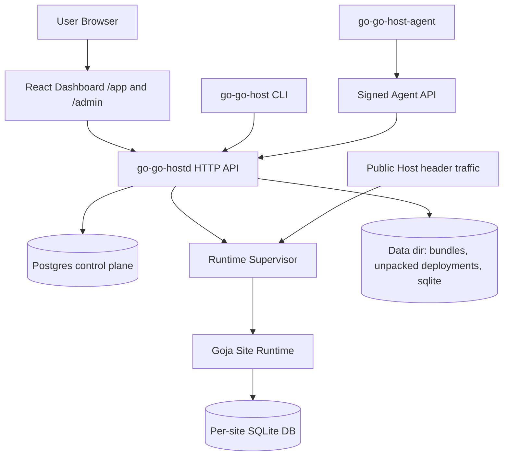
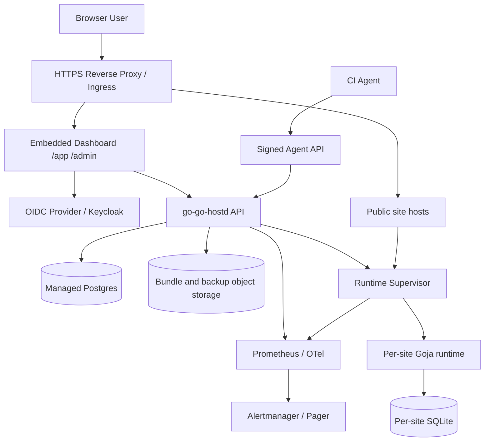

# go-go-host production readiness and beta launch implementation guide

## Executive summary

`go-go-host` is close to a beta-quality hosting platform, but it is not yet ready to run for real users without a focused production-readiness pass. The core product loop exists: users can create organizations and sites, upload immutable JavaScript bundles, activate or roll back deployments, enroll signed deployment agents, inspect audit events, manage site settings/domains/capabilities, and export/prune operational state. The missing work is not one large feature. It is a set of production seams: real browser authentication, platform-admin bootstrap, domain verification and TLS, secret storage, stronger runtime isolation, operational durability, CI/release automation, and repeatable end-to-end tests.

The most important conclusion is that beta readiness should be staged. First make local and staging environments behave like production: Keycloak/OIDC login in the browser, seeded realm/users, platform-admin bootstrap, and a devctl stack that starts the same components beta will use. Next close the externally visible production holes: verified domains, TLS/reverse proxy configuration, stable deployment packaging, backup/restore, and dashboards for incident response. Only after that should the service accept beta users who can run arbitrary hosted code, because the hosted runtime is intentionally constrained but still powerful enough to allocate CPU, fill SQLite databases, and handle public traffic.

This document is written for a new intern who needs to understand the system before implementing the production push. It starts with the current architecture, then explains the gaps in priority order, then turns each gap into concrete implementation work with files, APIs, pseudocode, tests, and review instructions.

## Production-readiness priority order

The following table is the shortest answer to “what is missing?” The order matters. Authentication and bootstrap come before beta users; domain/TLS comes before real public traffic; runtime containment and backup come before allowing people to rely on the service.

| Priority | Work package | Why it comes here | Beta launch impact |
| --- | --- | --- | --- |
| P0 | Browser OIDC/Keycloak login and logout | The UI still depends on dev-auth semantics; beta users need real accounts. | Blocks beta. |
| P0 | Platform-admin bootstrap for OIDC users | Real OIDC users currently have no production-safe path to become platform admins. | Blocks operations. |
| P0 | Keycloak local/staging bootstrap and devctl integration | Local testing should exercise the same auth path as staging. | Blocks confidence. |
| P0 | Production configuration and secret injection | The example config exists, but there is no hardened config/env story. | Blocks deploy. |
| P0 | Release artifact and deployment pipeline | There is a Dockerfile, but no image publishing, migration job, or deployment recipe with health gates. | Blocks repeatable deploy. |
| P1 | Domain verification and TLS routing | Domain rows exist, but verification is a manual placeholder and TLS automation is absent. | Blocks real customer domains. |
| P1 | Runtime isolation hardening | Goja runs in-process; HTTP timeout is not the same as CPU interruption or memory isolation. | Required before untrusted beta code. |
| P1 | Secrets/environment design and encrypted storage | The API explicitly says secrets are not implemented. Apps need safe secrets eventually. | Blocks many real apps. |
| P1 | Backup/restore and disaster recovery drills | Export APIs exist, but automated backups and restore validation are missing. | Required for trust. |
| P1 | Observability: metrics, logs, tracing, alerts | Runtime/admin pages exist, but no Prometheus/OpenTelemetry/SLO alerting. | Required for operations. |
| P2 | Billing/quotas/rate limiting and abuse controls | Quotas exist in the DB/runtime, but no product-level enforcement for signup/deploy/API abuse. | Required beyond closed beta. |
| P2 | User/team management and invitations | Membership tables exist, but no invitation/admin UX for beta org onboarding. | Important for teams. |
| P2 | CI E2E and security regression suite | There is a gated script, but it is not a CI job with real Keycloak and browser login. | Required for safe iteration. |
| P2 | Production runbooks and incident playbooks | Some runbooks exist, but not a full on-call package. | Required for sustainable ops. |

## Current-state architecture

The platform is split into a control plane, a hosted runtime, dashboards, CLIs, and a dev stack. Understanding those boundaries prevents production work from landing in the wrong layer.



### Control plane and HTTP API

The HTTP entrypoint is `internal/httpapi/handler.go`. It wires health/readiness, dashboard serving, user/org/site APIs, deployment APIs, agent APIs, admin APIs, site settings APIs, and maintenance APIs. The file shows that `/readyz` now performs DB and data-dir checks, which is a good foundation for production health gates. It also shows a critical current limitation: `/api/v1/config` exposes only `baseDomain`, `publicBaseUrl`, and `devAuth`; it does not expose OIDC browser-login configuration yet.

Evidence:

- `internal/httpapi/handler.go:15-31` wires dashboard and config responses.
- `internal/httpapi/handler.go:33-84` lists the current API surface.
- `internal/httpapi/handler.go:102-126` implements readiness checks against the store and writable data dir.

### Authentication

Authentication has two paths. The dev path reads `X-Go-Go-Host-User` and creates users under issuer `dev`. The OIDC path validates bearer ID tokens using OIDC discovery and client ID verification. The backend can verify tokens, but the browser frontend does not yet know how to obtain or attach them.

Evidence:

- `internal/httpapi/auth.go:28-40` switches between dev auth and OIDC based on `devAuth`.
- `internal/httpapi/auth.go:53-78` implements dev-auth user creation and dev platform-admin seeding.
- `internal/httpapi/oidc.go:30-63` validates a bearer token, extracts claims, and upserts a user.
- `web/admin/src/services/goGoHostApi.ts:6-12` uses `fetchBaseQuery({ baseUrl: '/api/v1' })` with no Authorization header preparation.

This makes OIDC the first P0 item. A beta user cannot reasonably test the dashboard if account switching depends on browser header injection.

### Dev stack and Keycloak

The Docker Compose file already defines Keycloak and a Keycloak Postgres database. The devctl plugin, however, only starts the app Postgres service and runs the daemon with `configs/dev.yaml`, which has `devAuth: true`. There is also a `configs/dev.postgres-keycloak.yaml`, but it still sets `devAuth: true`, so it is not a real local OIDC mode.

Evidence:

- `deployments/dev/docker-compose.yaml:19-35` defines Keycloak on port `18080`.
- `deployments/dev/docker-compose.yaml:37-50` defines Keycloak Postgres.
- `plugins/go-go-host-devctl.py:76-83` starts only `postgres` and runs `go-go-hostd` with `configs/dev.yaml`.
- `configs/dev.postgres-keycloak.yaml:6-8` declares OIDC issuer/client but leaves `devAuth: true`.

### Dashboard

The dashboard is a single React/Vite/RTK Query app served under `/app` and `/admin`. It understands whether dev auth is enabled enough to show a badge, but it does not implement login/logout or token attachment.

Evidence:

- `web/admin/vite.config.ts:4-16` sets `/app/` base and proxies `/api` in dev.
- `web/admin/src/components/organisms/AppShell/AppShell.tsx:16-24` displays `Dev auth ON` and user label.
- `web/admin/src/services/goGoHostApi.ts:6-12` defines a plain unauthenticated fetch base query.

### Runtime and deployment

The hosted runtime is in-process Goja. It gives sites an Express-like router, a UI DSL, a preconfigured SQLite database, DB guard, safe utility modules, and static assets. It intentionally does not expose unrestricted `fs` or `exec`. Runtime activation builds the next runtime and smoke-checks it before swapping traffic.

Evidence:

- `internal/runtime/runtime.go:25-39` defines runtime spec fields such as hosts, script/assets dirs, DB path, quotas, and timeout.
- `internal/runtime/runtime.go:79-94` wires UI rendering, DB guard, database aliases, middleware, Express, UI DSL, and DB guard modules.
- `internal/runtime/runtime.go:123-138` implements runtime health checks.
- `internal/runtime/supervisor.go:76-117` activates runtimes with build/smoke before traffic swap.
- `internal/runtime/supervisor.go:120-147` supports restart and stop operations.

The missing production piece is stronger isolation. `http.TimeoutHandler` and DB quota checks are useful, but they are not a full sandbox boundary for CPU, memory, or long-running Goja execution.

### Site settings, domains, and secrets

Site config, domains, and capabilities exist as API surfaces. Domains can be added, verified manually, and listed. Secrets are explicitly a placeholder: the environment endpoint says secrets and process-env passthrough are intentionally not implemented.

Evidence:

- `internal/httpapi/site_settings.go:63-124` implements config list/upsert/delete.
- `internal/httpapi/site_settings.go:126-167` implements capability list/update.
- `internal/httpapi/site_settings.go:169-239` implements domain list/add/verify/delete.
- `internal/httpapi/site_settings.go:241-253` returns the environment/secrets placeholder.

That means the production plan must include real domain verification/TLS and a real secret store before applications can depend on external APIs securely.

### Maintenance and operations

Maintenance APIs now export metadata, SQLite databases, deployment bundles, prune deployments, and retain audit logs. That is useful for operators, but production needs automated backups, restore drills, retention policies, and alerts.

Evidence:

- `internal/control/maintenance.go:45-68` exports site metadata.
- `internal/control/maintenance.go:70-102` resolves SQLite DB and deployment bundle paths with data-dir containment checks.
- `internal/control/maintenance.go:104-140` prunes deployment artifacts.
- `internal/control/maintenance.go:143-158` performs platform-admin-only audit retention.

### Developer and agent documentation

The CLI now bundles developer, JavaScript API, and agent guides. This is a beta strength because developers can learn from the binaries. The docs should become part of beta onboarding and CI checks.

Evidence:

- `cmd/go-go-host/doc/developer-guide.md:28-59` explains app bundles and manifest basics.
- `cmd/go-go-host/doc/js-api-reference.md:23-42` defines the JS API boundary and forbidden modules.
- `cmd/go-go-host-agent/doc/agent-guide.md:30-44` explains machine identity and signed deployment roles.

## Gap analysis by beta user journey

A beta user journey is not only “can I upload a bundle?” A beta user must sign up, create a site, point a domain, deploy safely, recover from mistakes, and trust that operators can debug incidents.

### Journey 1: sign in and create a site

Current state: dev auth works; backend bearer-token OIDC works; browser OIDC does not.

Missing pieces:

1. Keycloak realm import for local/staging.
2. Browser OAuth Authorization Code + PKCE flow.
3. Token storage/refresh/logout in the frontend.
4. RTK Query Authorization header injection.
5. Backend platform-admin bootstrap for OIDC claims.
6. Integration tests for invalid issuer, audience, signature, expiry, and claim mapping.

### Journey 2: deploy a JavaScript app

Current state: upload/validate/activate/rollback works, and agent deploys work.

Missing pieces:

1. CI E2E job that deploys with real OIDC and real agent credentials.
2. Better template/example bundles and `bundle init` tooling.
3. Developer-facing validation explanations for common JS API errors.
4. Runtime interruption for CPU-bound scripts.
5. Memory/concurrency limits around in-process runtimes.

### Journey 3: point a domain and serve public traffic

Current state: primary hosts work; custom domain rows and manual verify placeholder exist.

Missing pieces:

1. DNS TXT/CNAME verification checks.
2. Domain ownership recheck/expiry policy.
3. TLS certificate automation or reverse-proxy integration.
4. Hot-add or restart prompt after verifying a domain.
5. Base-domain wildcard DNS/TLS production recipe.

### Journey 4: store secrets and call external services

Current state: non-secret config exists; secrets are intentionally not implemented.

Missing pieces:

1. Encrypted secret table.
2. KMS/SOPS/age or cloud secret manager integration.
3. Secret injection model into Goja that does not expose process env wholesale.
4. Audit events for secret create/update/delete/read-by-runtime.
5. Redaction in logs, audit metadata, and UI.

### Journey 5: operate incidents and recover data

Current state: export/prune/readiness/runbooks exist.

Missing pieces:

1. Scheduled backups for Postgres and per-site SQLite.
2. Restore command/runbook tested in CI or nightly staging.
3. Object storage target for bundles and DB backups.
4. Metrics and alerts for runtime errors, deploy failures, DB quota pressure, disk space, auth failures, and agent security events.
5. Log correlation using request ID/org ID/site ID/deployment ID.

## Proposed production architecture

Production should keep the current core shape but add real identity, edge, isolation, and operations layers.



The beta version can still be a single daemon plus Postgres and data volume, but it should be deployed behind an HTTPS edge that owns TLS and forwards Host headers correctly. The daemon should not be responsible for ACME on day one unless that is explicitly chosen; it only needs a clear integration contract with the edge.

## Implementation work packages

### P0-A: Browser OIDC and local Keycloak parity

#### Goal

Make local development, staging, and beta use the same real login path. Remove dev-user from normal browser testing.

#### Files to change

- `deployments/dev/docker-compose.yaml`
- `deployments/dev/keycloak/realm-go-go-host.json` (new)
- `configs/dev.keycloak.yaml` (new or replace `dev.postgres-keycloak.yaml`)
- `plugins/go-go-host-devctl.py`
- `internal/config/config.go`
- `internal/httpapi/handler.go`
- `web/admin/src/services/goGoHostApi.ts`
- `web/admin/src/app/routes.tsx`
- new frontend auth module such as `web/admin/src/auth/oidc.ts`

#### Backend API sketch

Extend `/api/v1/config`:

```json
{
  "baseDomain": "localhost",
  "publicBaseUrl": "http://127.0.0.1:8080",
  "devAuth": false,
  "oidc": {
    "issuer": "http://127.0.0.1:18080/realms/go-go-host",
    "clientId": "go-go-host-dashboard",
    "redirectPath": "/app/auth/callback",
    "logoutRedirectPath": "/app"
  }
}
```

#### Frontend pseudocode

```ts
const userManager = new UserManager({
  authority: config.oidc.issuer,
  client_id: config.oidc.clientId,
  redirect_uri: `${origin}/app/auth/callback`,
  response_type: 'code',
  scope: 'openid profile email',
  automaticSilentRenew: true,
});

const baseQuery = fetchBaseQuery({
  baseUrl: '/api/v1',
  prepareHeaders: async (headers) => {
    const user = await userManager.getUser();
    if (user?.id_token) headers.set('Authorization', `Bearer ${user.id_token}`);
    return headers;
  },
});
```

#### Tests

- Unit test config rendering when `devAuth=false`.
- Frontend Storybook auth states: unauthenticated, loading, logged-in, expired.
- Playwright test: login as Alice, create org/site; logout; login as Bob; verify Bob cannot see Alice org until invited.
- Backend tests for invalid issuer/audience/expired token/signature.

#### Acceptance criteria

- `devctl up --force` starts Postgres, Keycloak, daemon, dashboard, and Storybook.
- Browser can login/logout using Keycloak users.
- RTK Query attaches `Authorization` header.
- Dev-user headers are no longer needed for browser testing.

### P0-B: Platform-admin bootstrap

#### Goal

Provide a production-safe way to create the first platform admin and map OIDC users to admin status.

#### Options

| Option | Pros | Cons |
| --- | --- | --- |
| Configured admin emails/subjects | Simple and transparent. | Requires config deploy to change admins. |
| OIDC realm role mapping | Fits Keycloak and enterprise IdPs. | Requires role claim parsing and docs. |
| One-time bootstrap CLI | Strong explicit ceremony. | Needs secure bootstrap token/state. |

Recommended beta path: support configured OIDC subjects/emails and OIDC realm roles, then add a one-time bootstrap CLI later.

#### Config sketch

```yaml
platformAdminOIDCSubjects:
  - "keycloak-subject-guid"
platformAdminEmails:
  - "admin@example.com"
platformAdminRoles:
  - "go-go-host-admin"
```

#### Backend pseudocode

```go
user := UpsertUserFromOIDC(...)
if subject in cfg.PlatformAdminOIDCSubjects || email in cfg.PlatformAdminEmails || claims.HasRole(cfg.PlatformAdminRoles) {
    store.AddPlatformAdmin(ctx, user.ID)
}
```

#### Acceptance criteria

- Local Keycloak `admin` user becomes platform admin automatically.
- Non-admin OIDC users cannot access `/api/v1/admin/*`.
- Admin bootstrap events are audited.

### P0-C: Deployment pipeline and release artifacts

#### Goal

Make production deploy repeatable and boring.

#### Current evidence

`Dockerfile:1-22` builds daemon, CLI, and agent in a Debian runtime because SQLite uses CGO. `configs/production.example.yaml:1-13` gives a first production config example. That is a good start, but not a deploy pipeline.

#### Missing pieces

1. GitHub Actions image build and push.
2. Image tags by commit SHA and version.
3. Migration job or startup migration policy documented.
4. Helm chart, Compose production recipe, or systemd unit.
5. Health gate using `/readyz`.
6. Rollback instructions.

#### Acceptance criteria

- A tagged commit produces an image.
- Staging deploy pulls that image and runs migrations.
- `/readyz` gates readiness.
- Operator can roll back to previous image and preserve data dir/Postgres.

### P1-A: Domain verification and TLS

#### Goal

Let beta users attach domains safely.

#### Current evidence

`internal/httpapi/site_settings.go:169-239` implements domain CRUD and manual verify. The domain verify endpoint currently marks a domain verified through an authenticated API call; it does not perform DNS proof.

#### Proposed verification API

```http
POST /api/v1/sites/{site_id}/domains
GET  /api/v1/sites/{site_id}/domains/{domain_id}/verification
POST /api/v1/sites/{site_id}/domains/{domain_id}/verify
```

Verification response:

```json
{
  "hostname": "www.example.com",
  "status": "pending",
  "method": "dns-txt",
  "recordName": "_go-go-host.www.example.com",
  "recordValue": "ggh-verify-...",
  "lastCheckedAt": "...",
  "lastError": "TXT record not found"
}
```

#### TLS plan

For beta, prefer edge-managed TLS:

- wildcard TLS for `*.sites.example.com`,
- customer domains terminate at Caddy/Traefik/Nginx/Ingress,
- edge forwards `Host` to go-go-hostd,
- go-go-hostd routes by Host header.

Add ACME automation later if go-go-host must manage certs directly.

### P1-B: Runtime isolation hardening

#### Goal

Make hosted code safer before accepting untrusted beta apps.

#### Current evidence

`internal/runtime/runtime.go:79-94` wires safe modules and excludes unrestricted fs/exec. `internal/runtime/supervisor.go:76-117` performs activation health checks. These are good controls, but they are not a process sandbox.

#### Missing controls

1. Goja interrupt support for CPU-bound loops.
2. Per-request execution deadlines inside the VM, not only HTTP response timeout.
3. Memory accounting or runtime-per-process isolation.
4. Concurrency limits per site.
5. Panic containment and runtime restart policy.
6. Disable or review app-level `db.guard.configure`.
7. Structured runtime event stream with retention and dashboard filtering.

#### Pseudocode: Goja interrupt

```go
ctx, cancel := context.WithTimeout(parent, siteTimeout)
defer cancel()

go func() {
    <-ctx.Done()
    vm.Interrupt("request timeout")
}()

_, err := owner.Call(ctx, "http-handler", func(ctx context.Context, vm *goja.Runtime) (any, error) {
    return handler(...)
})
```

If this cannot be made safe in-process, isolate each site runtime in a subprocess or container and communicate over an internal HTTP or RPC boundary.

### P1-C: Secrets and environment

#### Goal

Allow real apps to use API keys without exposing process environment or plaintext secrets.

#### Current evidence

`internal/httpapi/site_settings.go:241-253` explicitly returns an environment placeholder saying secrets are not implemented and process env passthrough is not supported.

#### Design sketch

Tables:

```sql
CREATE TABLE site_secrets (
  site_id TEXT NOT NULL REFERENCES sites(id) ON DELETE CASCADE,
  name TEXT NOT NULL,
  ciphertext BYTEA NOT NULL,
  key_id TEXT NOT NULL,
  created_at TIMESTAMPTZ NOT NULL,
  updated_at TIMESTAMPTZ NOT NULL,
  PRIMARY KEY (site_id, name)
);
```

JS API:

```js
const secrets = require("secrets");
const apiKey = secrets.get("STRIPE_API_KEY");
```

Rules:

- Secrets are never returned by list APIs.
- Secret reads are available only at runtime and audited as aggregate counters, not value logs.
- UI shows names, timestamps, and rotation state, not values.
- Logs redact any configured secret values if they appear by accident.

### P1-D: Backup, restore, and disaster recovery

#### Goal

Prove data can be recovered, not merely exported.

#### Current evidence

`internal/control/maintenance.go:45-102` exports metadata, SQLite, and deployment bundle paths. Export is manual; backup scheduling and restore drills are missing.

#### Required work

1. Nightly Postgres backup.
2. Nightly per-site SQLite backup or snapshot while runtime is stopped/consistent.
3. Bundle/object-store backup.
4. Restore command that creates a new site or restores a site in place.
5. Drill: restore staging from backup and run smoke tests.
6. Document RPO/RTO.

### P1-E: Observability and alerting

#### Goal

Make failures visible before users report them.

#### Metrics to add

```text
go_go_host_http_requests_total{route,status}
go_go_host_deployments_total{status,actor_type}
go_go_host_runtime_requests_total{site_id}
go_go_host_runtime_errors_total{site_id}
go_go_host_runtime_active_sites
go_go_host_agent_signature_failures_total{reason}
go_go_host_db_bytes{site_id}
go_go_host_bundle_bytes{site_id}
go_go_host_audit_events_total{action}
```

Add structured logs with `requestId`, `orgId`, `siteId`, `deploymentId`, and `actorId`. Add dashboards for deploy failures, runtime errors, quota pressure, auth failures, and disk usage.

## Implementation phase plan

### Phase 1: Real local auth and admin bootstrap (must finish first)

Tasks:

- Add Keycloak realm import with users Alice, Bob, and Admin.
- Update devctl to start Keycloak and run daemon with `devAuth: false` in a new local profile.
- Add frontend OIDC/PKCE login/logout/callback.
- Add Authorization header injection to RTK Query.
- Add OIDC admin bootstrap config and tests.
- Add browser E2E for login/logout/user isolation.

Exit criteria:

- A developer can run one command and test real browser login locally.
- Alice and Bob are distinct users in the UI.
- Admin can access `/admin`; Alice cannot unless granted.

### Phase 2: Staging deploy pipeline

Tasks:

- Add image build/push GitHub Action.
- Add staging config and deployment recipe.
- Add migration policy.
- Add `/readyz` health gate to deployment.
- Add staging smoke script.

Exit criteria:

- Every main-branch merge can deploy to staging.
- Staging uses OIDC, Postgres, persistent data dir, and HTTPS.

### Phase 3: Domain/TLS beta traffic

Tasks:

- Implement DNS TXT verification.
- Add domain recheck job and status fields.
- Write reverse-proxy/TLS recipe.
- Add dashboard copy for domain setup.
- Add integration test using fake DNS resolver.

Exit criteria:

- Beta user can prove ownership of a custom domain.
- Edge routes HTTPS traffic to go-go-hostd preserving Host.

### Phase 4: Runtime containment

Tasks:

- Add Goja interrupt on request timeout.
- Add per-site concurrency limiter.
- Add memory/process isolation design decision.
- Add runtime crash loop protection.
- Add runtime event stream UI.

Exit criteria:

- CPU-bound infinite loop cannot consume the process indefinitely.
- One noisy site cannot starve all sites in beta.

### Phase 5: Secrets and external app readiness

Tasks:

- Add encrypted site secrets store.
- Add secrets dashboard and API.
- Add JS `secrets` module with strict policy.
- Add redaction tests.
- Add audit events.

Exit criteria:

- Apps can use API keys without process-env passthrough.
- Secret values are not returned or logged.

### Phase 6: Backup, restore, and observability

Tasks:

- Add scheduled backups.
- Add restore CLI/API.
- Add Prometheus/OTel metrics.
- Add alert rules.
- Run restore drill.

Exit criteria:

- Operators can restore a beta site from backup.
- Runtime/deploy/auth failures produce alerts.

### Phase 7: Beta onboarding and support package

Tasks:

- Add user invitation/member management.
- Publish developer guide and JS API reference from CLI docs to web docs.
- Add beta terms/acceptable use and abuse contact.
- Add support runbooks.
- Add feedback capture.

Exit criteria:

- A beta user can onboard without direct database edits or manual headers.
- Operators have a repeatable incident workflow.

## API reference additions needed

### Auth config

```http
GET /api/v1/config
```

Add:

```json
{
  "oidc": {
    "issuer": "...",
    "clientId": "...",
    "scopes": ["openid", "profile", "email"],
    "redirectUri": "...",
    "logoutRedirectUri": "..."
  }
}
```

### Domain verification

```http
GET /api/v1/sites/{site_id}/domains/{domain_id}/verification
POST /api/v1/sites/{site_id}/domains/{domain_id}/verify
```

### Secrets

```http
GET    /api/v1/sites/{site_id}/secrets
PUT    /api/v1/sites/{site_id}/secrets/{name}
DELETE /api/v1/sites/{site_id}/secrets/{name}
```

List response never includes values:

```json
[{"name":"STRIPE_API_KEY","updatedAt":"...","version":3}]
```

### Restore

```http
POST /api/v1/sites/{site_id}/restore
POST /api/v1/admin/restore/site
```

## Testing strategy

Production readiness needs layered tests. Unit tests are necessary but not enough because the riskiest flows cross Keycloak, browser storage, Postgres, filesystem artifacts, and public Host-header routing.

### Required test layers

1. Backend unit tests for auth claim mapping, admin bootstrap, domain verification, secrets redaction, and runtime limits.
2. Integration tests with Postgres for migrations, OIDC users, grants, deployments, and maintenance APIs.
3. Frontend tests for authenticated states, token refresh, logout, admin route guards, domain setup, and secrets UI.
4. Playwright E2E against devctl with Keycloak: login, create site, deploy, activate, custom domain placeholder, agent deploy, rollback, export, audit.
5. Staging smoke after deploy: `/readyz`, login, API version, dashboard render, one test deployment.
6. Security regression tests: invalid OIDC tokens, revoked agent key, replayed nonce, denied capability, DB hard limit, CPU timeout.

### CI gate proposal

```text
pull_request:
  - go test ./...
  - pnpm --dir web/admin build
  - make storybook-build
  - sqlc generate && git diff --exit-code
  - security smoke tests without external services

main branch nightly:
  - devctl keycloak stack
  - Playwright OIDC E2E
  - restore drill against temporary data dir
```

## Risks and alternatives

### Risk: in-process Goja is not strong enough isolation

The current design is productive and simple, but in-process runtimes share fate with the daemon. For closed beta with trusted users, this may be acceptable if CPU interruption and concurrency limits are added. For broader beta, subprocess or container isolation should be reconsidered.

Alternative: run each site in a worker process with a narrow HTTP/RPC protocol. This costs more operational complexity but improves blast-radius control.

### Risk: Keycloak local setup becomes too heavy

Keycloak improves realism but slows local startup. Keep a dev-auth profile for fast backend work, but make the default beta/staging profile OIDC. The important rule is that release validation uses real OIDC.

### Risk: domain/TLS scope grows too large

Do not build an ACME platform if a reverse proxy can do it first. For beta, document and automate a known edge stack. Add internal ACME only if product requirements demand it.

### Risk: secrets become a security liability

Secret storage is easy to implement badly. Do not ship plaintext secret APIs. Use envelope encryption or an external secret manager and test redaction before exposing secrets to beta users.

## File reference map

| Area | Files |
| --- | --- |
| Auth middleware | `internal/httpapi/auth.go`, `internal/httpapi/oidc.go` |
| Config | `internal/config/config.go`, `configs/dev.yaml`, `configs/dev.postgres-keycloak.yaml`, `configs/production.example.yaml` |
| Dev stack | `deployments/dev/docker-compose.yaml`, `plugins/go-go-host-devctl.py` |
| Frontend API | `web/admin/src/services/goGoHostApi.ts`, `web/admin/src/services/types.ts` |
| Frontend shell | `web/admin/src/components/organisms/AppShell/AppShell.tsx`, `web/admin/src/app/routes.tsx` |
| Runtime | `internal/runtime/runtime.go`, `internal/runtime/supervisor.go`, `internal/sitejs/*` |
| Site settings | `internal/httpapi/site_settings.go`, `internal/control/services.go`, `internal/store/sites.go` |
| Maintenance | `internal/control/maintenance.go`, `internal/httpapi/maintenance.go`, `cmd/go-go-host/cmds/maintenance.go` |
| Agent deploy | `internal/control/agent_runs.go`, `internal/httpapi/agents_audit.go`, `cmd/go-go-host-agent/cmds/*` |
| Docs | `cmd/go-go-host/doc/developer-guide.md`, `cmd/go-go-host/doc/js-api-reference.md`, `cmd/go-go-host-agent/doc/agent-guide.md` |
| Packaging | `Dockerfile`, `.github/workflows/*`, `.goreleaser.yaml` |
| E2E | `scripts/final-e2e-playwright.mjs` |

## Intern checklist

Start with Phase 1. Do not begin custom domains or secrets until real browser OIDC works locally.

1. Run `devctl up --force` and confirm current dev-auth stack.
2. Add Keycloak realm import.
3. Add `configs/dev.keycloak.yaml` with `devAuth: false`.
4. Update devctl to start Keycloak in the OIDC profile.
5. Add frontend PKCE login.
6. Add Authorization header injection.
7. Add platform-admin OIDC bootstrap.
8. Add E2E login tests.
9. Only then move to deployment pipeline, domains/TLS, and runtime isolation.

## Appendix: current beta readiness scorecard

| Category | Current score | Notes |
| --- | --- | --- |
| Core site/deploy loop | Good | Manual and agent deploys work. |
| Browser auth | Not ready | No PKCE login/token attachment. |
| Platform admin bootstrap | Not ready | Dev-only bootstrap exists. |
| Hosted runtime | Beta with trusted users only | Needs CPU/concurrency isolation. |
| Domains/TLS | Not ready | Manual domain verification placeholder only. |
| Secrets | Not ready | Explicitly deferred. |
| Backup/export | Partial | Manual exports exist; scheduled backups/restore drills missing. |
| Observability | Partial | Runtime/admin surfaces exist; metrics/alerts missing. |
| CI/E2E | Partial | Gated script exists; no full CI Keycloak E2E. |
| Docs | Good | Developer, JS API, and agent guides are bundled. |
