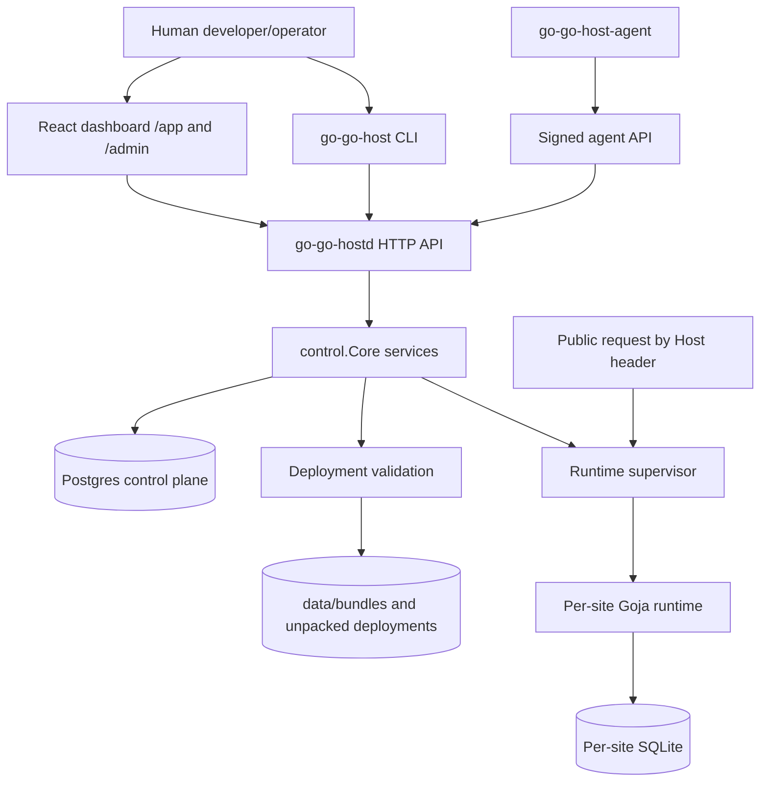
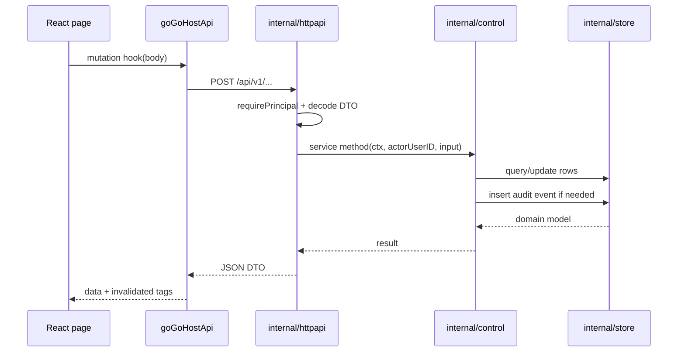
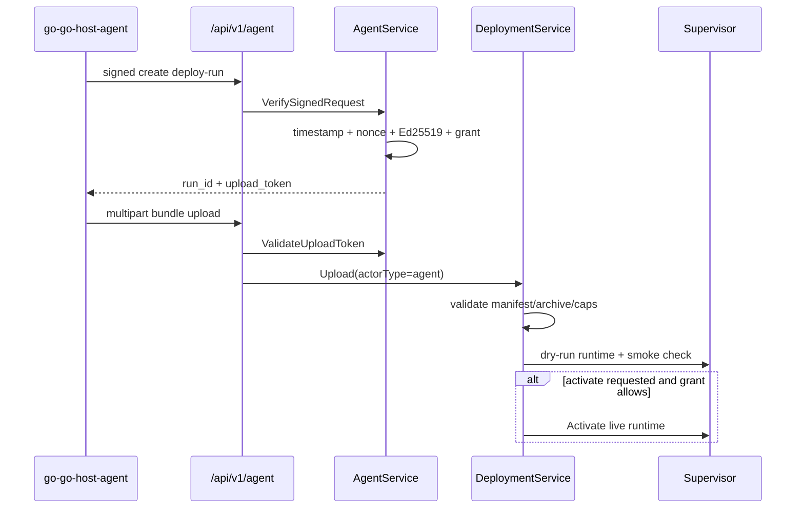
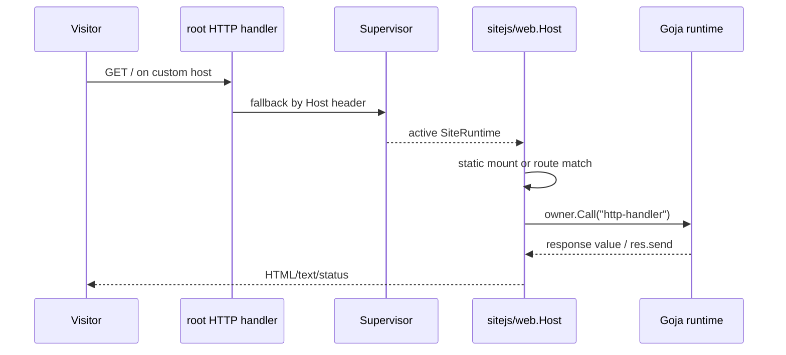

# Contributor guideline backbone design

## Executive summary

`go-go-host` needs more than a single `CONTRIBUTING.md`. The repository is now a multi-surface hosting platform with a Go daemon, human CLI, deployment-agent CLI, Postgres control plane, immutable deployment pipeline, in-process Goja runtime, per-site SQLite data plane, React/Vite dashboard, Storybook/MSW frontend workflow, devctl local stack, and a growing set of ticket-local design/runbook documents. A future contributor can easily change the wrong layer, bypass a security invariant, duplicate dashboard patterns, or ship a feature that lacks tests and operational docs.

The recommended backbone is a **small stable documentation tree** under `docs/` plus a clear rule for using `ttmp/` tickets as investigation memory. Stable docs should tell contributors where code belongs, how requests flow through the system, which APIs and invariants are authoritative, how to validate work, and how to promote learned practices. Ticket docs should keep diaries, design alternatives, screenshots, and implementation notes until a pattern is mature enough to promote.

The highest-value first tranche is:

1. `docs/contributing/README.md` — contribution entrypoint and decision tree.
2. `docs/contributing/architecture-map.md` — one-page system map with file references.
3. `docs/contributing/backend-service-guidelines.md` — Go layering, HTTP/control/store/runtime rules.
4. `docs/contributing/runtime-and-deployment-guidelines.md` — bundle, manifest, capabilities, supervisor, and Goja safety rules.
5. `docs/contributing/frontend-dashboard-guidelines.md` — index that delegates to the existing OS1 dashboard playbook.
6. `docs/contributing/testing-and-validation.md` — required test commands by contribution lane.
7. `docs/contributing/docmgr-and-ticket-workflow.md` — when to create a ticket, keep a diary, relate files, and promote docs.
8. `docs/runbooks/local-development.md` — devctl, Postgres/Keycloak, daemon, dashboard, Storybook, and smoke commands.
9. `docs/architecture/api-surface.md` — route/API map generated manually from `internal/httpapi/handler.go` until an automated extractor exists.
10. `docs/architecture/data-model.md` — schema concepts and migration/sqlc workflow.

This ticket also includes a companion implementation runbook for creating that set.

## Problem statement and scope

The user asked for contribution guidelines that can support “a lot of humans and agents” working on `go-go-host`. That implies the documentation must do four jobs:

- **Onboard:** explain what the system is and how its parts fit together.
- **Constrain:** document invariants so contributors do not break security, deployment, runtime, or UI consistency.
- **Guide:** give file-level starting points and pseudocode for common changes.
- **Validate:** list commands and review checklists so work can be merged consistently.

Out of scope for this ticket: implementing every stable repository-facing doc. This ticket is the analysis/design package and implementation guide for doing that work safely.

## Current documentation state

### Existing repository-facing docs

- `AGENT.md` contains practical coding-agent rules: build/test commands, tmux guidance for servers, Go conventions, web conventions, no unnecessary backwards compatibility, and debugging stop rules.
- `README.md` explains the original product concept, local run commands, capability model, dashboard model, and Glazed CLI model. It still says the repository is in “Phase 0 scaffold work,” which is no longer accurate given the current source tree.
- `docs/contributing/playbooks/os1-admin-dashboard-ui-work-guidelines.md` is the best current example of a promoted contributor playbook. It provides environment assumptions, visual design rules, Storybook/MSW workflow, screenshot loop, and concrete CSS/TSX examples.

### Existing ticket-local docs

The `ttmp/` tree contains the actual project memory:

- `HOST-001` explains the v1 platform architecture and intern mental model.
- `HOST-003` contains a local admin dashboard runbook.
- `HOST-004` explains agent/deployment hardening.
- `HOST-006` explains production readiness and beta launch gaps.
- `HOST-008` contains the OS1 visual polish investigation and promoted playbook.
- `HOST-009` brainstorms dashboard docs, onboarding, and JS API playground.

These are valuable, but new contributors should not have to discover them with `find ttmp -maxdepth 6 -type f -name '*.md'`. Stable docs should link to the durable parts.

## System overview for a new intern

`go-go-host` hosts small server-side JavaScript sites inside Go. Humans and deployment agents upload bundles. The control plane stores users, organizations, sites, deployments, agent keys, grants, audit events, domains, quotas, and runtime status in Postgres. The runtime plane unpacks validated bundles, builds a Goja runtime for each active site, provides explicit modules such as `express`, `ui.dsl`, and scoped `database`, and dispatches public HTTP traffic by host name.



The central rule for contributors: **do not jump layers**. HTTP handlers and CLIs are transports. Product rules belong in `internal/control`. Durable data belongs in `internal/store` and SQL migrations/queries. Runtime execution belongs in `internal/runtime` and `internal/sitejs`. Dashboard state belongs in RTK Query and page/component modules.

## Architecture map with evidence

### Entrypoints and tools

| Area | Files | What contributors should know |
|---|---|---|
| Daemon | `cmd/go-go-hostd/main.go` | Loads config, opens store, applies migrations, builds `control.Core`, serves HTTP. Evidence: migrations and core wiring appear at `cmd/go-go-hostd/main.go:57-64`. |
| Human CLI | `cmd/go-go-host`, `cmd/go-go-host/cmds/*.go` | Uses Glazed command structs and `RunIntoGlazeProcessor`; README documents this model at `README.md:81-85`. |
| Agent CLI | `cmd/go-go-host-agent`, `cmd/go-go-host-agent/cmds/*.go` | Handles keygen, enrollment, status, and signed deploy requests. |
| Web build | `cmd/build-web/main.go`, `internal/webadmin/handler.go` | Builds Vite output and embeds `dist`; `internal/webadmin/handler.go:13-19` embeds and serves the SPA. |
| Local commands | `Makefile` | `make test`, `make build`, `make web-build`, `make storybook-build`, `make oidc-e2e`; targets are visible at `Makefile:1-43`. |
| devctl | `.devctl.yaml`, `plugins/go-go-host-devctl.py` | Local stack orchestration should be documented as the preferred server workflow. |

### HTTP and API boundary

`internal/httpapi/handler.go` is the route map. It wires health/readiness, dashboard serving, config, user/org/site APIs, agent APIs, deployment APIs, admin APIs, and maintenance APIs. It also shows the auth boundary:

- User/admin API paths are wrapped with `authMiddleware` and mounted under `/api/v1/me`, `/api/v1/orgs`, `/api/v1/sites`, `/api/v1/deployments`, and `/api/v1/admin` (`internal/httpapi/handler.go:99-104`).
- Agent paths are mounted under `/api/v1/agent/` without that user auth wrapper because they use signed agent verification (`internal/httpapi/handler.go:105`).

Guideline: when adding an endpoint, first decide whether it is human-authenticated, platform-admin-only, org-member-scoped, site-scoped, or signed-agent. Then put the invariant in a control service, not only in the handler.

### Control services

`internal/control/core.go` defines the service boundary:

```go
type Core struct {
    Config     config.Config
    Store      *store.Store
    Supervisor *runtime.Supervisor
    Orgs        *OrgService
    Sites       *SiteService
    Deployments *DeploymentService
    Agents      *AgentService
    Audit       *AuditService
    Maintenance *MaintenanceService
}
```

Evidence: `Core` is defined at `internal/control/core.go:9-22`, and `NewCoreWithStore` wires all services at `internal/control/core.go:28-36`.

Guideline: new product logic should be a method on an existing service or a new service owned by `Core`. Handlers and CLIs should be thin adapters.

### Store, migrations, and sqlc

`internal/store/store.go` owns the Postgres pool and generated sqlc queries. Migrations are embedded with `//go:embed migrations/*.sql` at `internal/store/store.go:19`, and `ApplyMigrations` sorts and applies migration files under an advisory lock at `internal/store/store.go:48-75`.

The initial schema includes users, orgs, memberships, platform admins, sites, site domains, site quotas, site capabilities, deployments, deploy runs, agents, agent keys, agent grants, nonces, and audit log (`internal/store/migrations/001_initial_schema.sql:6-150`).

Guideline: schema changes require a migration, an update to `internal/store/queries/*.sql`, regenerated sqlc output, store wrapper methods, and tests. Do not hand-write SQL in HTTP handlers.

### Deployment pipeline

`internal/deploy/bundle.go` defines the bundle contract:

```go
const ManifestName = "go-go-host.json"

type Manifest struct {
    Name         string
    ScriptsDir   string
    AssetsDir    string
    Entrypoint   string
    SmokePath    string
    Capabilities []string
    AllowedPaths []string
    Channel      string
}
```

Evidence: safe capabilities are declared at `internal/deploy/bundle.go:21`, manifest fields at `internal/deploy/bundle.go:23-32`, and validation/storage starts at `internal/deploy/bundle.go:69`.

`internal/control/deployments.go` adds product rules: check actor role, reserve an immutable deployment ID, validate archive paths/capabilities/quotas, unpack into `data/sites/<site>/deployments/<deployment>`, dry-run a runtime, record validation JSON, audit upload/validation failure, and activate only validated/superseded/active deployments.

Guideline: deployment safety belongs at the final mutation boundary. UI and CLI can preflight, but `DeploymentService.Upload` and `DeploymentService.activate` must enforce.

### Runtime and hosted JavaScript

`internal/runtime/runtime.go` constructs a per-site runtime. Its `Spec` includes site/org/deployment IDs, hosts, scripts/assets paths, DB path, dev mode, health path, capabilities, DB limits, and timeout (`internal/runtime/runtime.go:21-38`). Runtime construction opens per-site SQLite, wires `dbguard`, preconfigures `database` and `db`, allows only selected middleware (`path`, and optionally `time`/`timer`), registers `express`, `ui.dsl`, and `dbguard`, loads scripts, and serves static `/assets` when enabled (`internal/runtime/runtime.go:58-118`).

`internal/sitejs/web/host.go` is the Go-to-JavaScript HTTP bridge. It serves static mounts first, matches routes, constructs request/response DTOs, and calls the JS handler through the runtime owner (`internal/sitejs/web/host.go:46-94`).

`internal/runtime/supervisor.go` owns active runtimes by site and host. `Activate` builds and health-checks the next runtime before swapping maps, then closes the old runtime asynchronously (`internal/runtime/supervisor.go:76-117`).

Guideline: do not expose unrestricted `fs`, `exec`, arbitrary DB DSNs, or global mutable host resources to hosted JS. New host capabilities require explicit policy, tests, docs, dashboard representation, and safe defaults.

### Dashboard frontend

The dashboard is a React/Vite/RTK Query app. `web/admin/package.json` declares React 19, Redux Toolkit, React Router, Vite, Storybook, MSW, TypeScript, Vitest, Playwright, and `@go-go-golems/os-core` (`web/admin/package.json:7-49`).

`web/admin/src/app/routes.tsx` defines two dashboard surfaces:

- `/app/...` for organization/site users.
- `/admin/...` for platform admins, guarded by `RequirePlatformAdmin` (`web/admin/src/app/routes.tsx:32-68`).

`web/admin/src/services/goGoHostApi.ts` defines the RTK Query API client with bearer-token header preparation (`web/admin/src/services/goGoHostApi.ts:7-13`), endpoint tags, user/site/deployment/runtime/admin/agent/audit endpoints, and generated hooks (`web/admin/src/services/goGoHostApi.ts:16-147`).

Guideline: API state should go through RTK Query. Add types in `services/types.ts`, endpoint definitions in `goGoHostApi.ts`, MSW fixtures/handlers for Storybook, then page/component stories.

## Contributor lanes and rules

### Lane A: Backend API feature

Use this lane for new HTTP endpoints, service methods, or store-backed product behavior.

Required flow:

```text
1. Update or create control service method.
2. Add store/query/migration if durable state is needed.
3. Add HTTP handler as a thin adapter.
4. Register route in internal/httpapi/handler.go.
5. Add integration tests at the HTTP or control layer.
6. Update CLI/frontend/docs if the API is user-facing.
```

Pseudocode:

```go
func handleThing(core *control.Core) http.HandlerFunc {
    return func(w http.ResponseWriter, r *http.Request) {
        principal, err := requirePrincipal(r)
        if err != nil { writeError(w, http.StatusUnauthorized, err.Error()); return }
        var req thingRequest
        if err := json.NewDecoder(r.Body).Decode(&req); err != nil { writeError(w, 400, "invalid JSON body"); return }
        out, err := core.Things.DoThing(r.Context(), principal.User.ID, req.ResourceID)
        if errors.Is(err, control.ErrPermissionDenied) { writeError(w, 403, err.Error()); return }
        if err != nil { writeError(w, 500, err.Error()); return }
        writeJSON(w, http.StatusOK, thingToDTO(out))
    }
}
```

Review checklist:

- Is authz enforced in `internal/control`, not only in the handler?
- Are audit events recorded for security-relevant mutations?
- Are errors mapped to stable HTTP status codes?
- Are DTO names and JSON fields stable and camelCase?
- Does the integration test exercise forbidden and allowed paths?

### Lane B: Deployment/runtime/capability change

Use this lane for bundle validation, hosted modules, Goja runtime construction, DB guard, assets, supervisor behavior, activation, rollback, or smoke checks.

Required flow:

```text
1. Define the capability or runtime invariant.
2. Add validation to internal/deploy or internal/control/deployments.go.
3. Wire runtime behavior in internal/runtime or internal/sitejs.
4. Add rejected-bundle tests and successful-runtime tests.
5. Update JS API docs and dashboard capability/admin docs.
```

Pseudocode for a new capability:

```go
// deploy/bundle.go
var SafeCapabilities = map[string]bool{
    "express": true,
    "ui.dsl": true,
    "database": true,
    "assets": true,
    "new.capability": false, // disabled until site policy enables it
}

// runtime/runtime.go
if spec.Capabilities.NewCapability {
    builder = builder.WithRuntimeModuleRegistrars(newcap.NewRegistrar(policy))
}
```

Review checklist:

- Is the safe default off unless intentionally enabled?
- Is the capability represented in site policy/admin UI?
- Does validation reject unknown or disabled capabilities?
- Does runtime close all resources on failed load or activation?
- Does public traffic swap only after health check success?

### Lane C: Dashboard page or component

Use this lane for `/app` or `/admin` UI work.

Required flow:

```text
1. Read docs/contributing/playbooks/os1-admin-dashboard-ui-work-guidelines.md.
2. Add or update RTK Query endpoints/types first.
3. Add MSW fixtures and handlers.
4. Build page/component with OS1 bridge tokens and existing primitives.
5. Add Storybook stories for loading, empty, error, and populated states.
6. Run screenshot review before committing visual changes.
```

Guideline: do not create modern SaaS cards with retro colors. The existing OS1 playbook is authoritative for spacing, window chrome, fonts, buttons, checkboxes, tables, and screenshots.

### Lane D: CLI command

Use this lane for `go-go-host` or `go-go-host-agent` commands.

Required flow:

```text
1. Create a Glazed command struct embedding *cmds.CommandDescription.
2. Define arguments/flags with fields.New.
3. Use shared HTTP/client helpers where possible.
4. Emit rows through RunIntoGlazeProcessor.
5. Add command docs under cmd/*/doc if user-facing.
```

Review checklist:

- Does the command work with `--output json` and table output?
- Does it avoid hiding server-side errors?
- Does it avoid duplicating authorization logic client-side?

### Lane E: Documentation/change-management work

Use this lane when writing or promoting docs.

Required flow:

```text
1. Create or reuse a docmgr ticket for non-trivial work.
2. Keep a diary for investigation and implementation steps.
3. Relate files that shaped the work.
4. Put stable docs under docs/ after review.
5. Link promoted docs from README or docs/contributing/README.md.
6. Run docmgr doctor before handoff.
```

Guideline: `ttmp` is for working memory; `docs` is for stable contributor guidance.

## Proposed stable documentation set

### 1. `docs/contributing/README.md`

Purpose: single entrypoint for humans and agents.

Contents:

- Repository purpose in one paragraph.
- “Which change are you making?” decision tree.
- Links to architecture map, backend guide, runtime/deployment guide, frontend guide, testing guide, docmgr workflow, local runbook.
- Minimum validation matrix.
- “Stop and ask” rules: sandbox/capability exposure, backwards compatibility shims, schema migrations, auth model changes, deployment activation semantics, dashboard design-system changes.

### 2. `docs/contributing/architecture-map.md`

Purpose: prevent layer confusion.

Contents:

- Mermaid diagram from this doc.
- Table of packages and ownership.
- Request flow diagrams for human API, agent deploy, public request, dashboard data fetch.
- File references with line anchors.

### 3. `docs/contributing/backend-service-guidelines.md`

Purpose: define Go backend contribution rules.

Contents:

- `cmd` vs `internal` boundaries.
- `httpapi -> control -> store/runtime` layering.
- Error handling and context rules.
- Auth/authz patterns.
- Audit event requirements.
- Migration/sqlc workflow.
- Integration-test patterns.

### 4. `docs/contributing/runtime-and-deployment-guidelines.md`

Purpose: protect hosted-code and deployment invariants.

Contents:

- Bundle manifest contract.
- Safe capabilities and policy model.
- Path validation and allowed paths.
- Dry-run validation and smoke path.
- Activation, rollback, and supervisor semantics.
- Hosted JS API boundary.
- Examples of allowed/disallowed modules.

### 5. `docs/contributing/frontend-dashboard-guidelines.md`

Purpose: dashboard contribution entrypoint.

Contents:

- Link to OS1 admin dashboard UI playbook.
- RTK Query endpoint/type/MSW/story workflow.
- Page route conventions.
- Storybook and screenshot validation commands.
- Accessibility and error/loading/empty state checklist.

### 6. `docs/contributing/testing-and-validation.md`

Purpose: make “done” consistent.

Suggested matrix:

| Change type | Required validation |
|---|---|
| Go backend only | `go test ./...`; targeted package test; `go fmt ./...`; `make lint` when feasible |
| Store/migration | Postgres dev stack; `go test ./internal/store ./internal/control`; migration idempotence check |
| HTTP API | Relevant `internal/httpapi` integration tests; auth forbidden/allowed cases |
| Runtime/deploy | `go test ./internal/deploy ./internal/runtime ./internal/httpapi`; rejected and accepted bundle cases |
| Dashboard | `cd web/admin && pnpm build && pnpm storybook:build`; Storybook states; screenshot review for visual work |
| Web embed | `go run ./cmd/build-web`; `go test ./internal/webadmin`; `go build ./...` |
| OIDC/e2e | devctl/compose stack; `make oidc-e2e` when touching auth |
| Docs ticket | `docmgr doctor --ticket <ID> --stale-after 30` |

### 7. `docs/contributing/docmgr-and-ticket-workflow.md`

Purpose: make ticket work repeatable.

Contents:

- When to create a ticket.
- Required diary format.
- How to relate files.
- How to promote docs.
- How to update changelog/tasks.
- Where screenshots and sources go.

### 8. `docs/runbooks/local-development.md`

Purpose: copy/paste local development.

Contents:

- Prerequisites: Go, pnpm, Docker, devctl, Postgres, Keycloak.
- `devctl up --force` flow.
- Manual daemon flow with `go run ./cmd/go-go-hostd --config configs/dev.yaml`.
- Dashboard dev server and embedded dashboard flow.
- Storybook flow.
- Common ports.
- How to kill stuck servers (`lsof-who -p $PORT -k`) and tmux guidance.

### 9. `docs/architecture/api-surface.md`

Purpose: stable route reference for contributors.

Contents:

- Generated or manually maintained route table from `internal/httpapi/handler.go`.
- Auth category per route: public, user, platform admin, signed agent.
- Request/response DTO file references.
- Frontend RTK endpoint references.

### 10. `docs/architecture/data-model.md`

Purpose: schema onboarding.

Contents:

- Main entities and relationships.
- Migration rules.
- sqlc query rules.
- Store wrapper naming.
- How data flows into dashboard DTOs.

## Request-flow diagrams

### Human dashboard mutation



### Agent deployment



### Public hosted request



## Implementation plan

### Phase 1: Create stable docs skeleton

- Add `docs/contributing/README.md`.
- Add `docs/contributing/architecture-map.md`.
- Add `docs/contributing/testing-and-validation.md`.
- Add `docs/runbooks/local-development.md`.
- Link existing dashboard playbook from the new frontend guide/index.
- Update `README.md` with a “Contributing” section pointing at the docs.

Exit criteria:

- New contributors can find the right guide from README in two clicks.
- Docs include exact validation commands.
- No conflicting dashboard guidance is introduced.

### Phase 2: Backend/runtime docs

- Add backend service guidelines.
- Add runtime/deployment guidelines.
- Add API surface route table.
- Add data model guide.
- Include pseudocode and review checklists from this document.

Exit criteria:

- A contributor adding an endpoint or capability has a documented path.
- Route/auth categories are explicit.
- Migration/sqlc workflow is documented.

### Phase 3: Tooling and drift prevention

- Add a script to extract route names from `internal/httpapi/handler.go` into a markdown table or validate the checked-in table.
- Add a docs freshness checklist to PR review.
- Consider CI that checks links and ensures docs mention new public routes/capabilities.

Exit criteria:

- Docs do not silently drift as route/capability surfaces grow.

## Risks and mitigations

| Risk | Impact | Mitigation |
|---|---|---|
| Docs become too large to read | Contributors ignore them | Keep entrypoint short; split by lane; use checklists. |
| Ticket docs and stable docs diverge | Conflicting guidance | Document promotion rules and link stable docs from ticket summaries. |
| Dashboard playbook duplicated | Visual inconsistency | Make frontend guide an index that delegates to existing OS1 playbook. |
| README remains stale | New contributors start with wrong mental model | Update README during Phase 1. |
| Agents follow docs mechanically but miss invariants | Security regressions | Include “stop and ask” rules and final-boundary enforcement patterns. |
| API docs drift | Frontend/backend mismatch | Add route extraction or route-table validation in Phase 3. |

## Open questions

1. Should stable architecture docs live under `docs/architecture/` or under `docs/contributing/architecture-*`?
2. Should `README.md` be rewritten now to match the current beta-capable system state?
3. Should route/API documentation be generated from Go source, OpenAPI-like DTO annotations, or manually maintained for now?
4. Should docs be enforced in PR templates or devctl checks?
5. Should this repository add a top-level `CONTRIBUTING.md` that simply redirects to `docs/contributing/README.md`?

## References

- `AGENT.md` — current agent and Go/web workflow rules.
- `README.md` — current public project description and command overview.
- `docs/contributing/playbooks/os1-admin-dashboard-ui-work-guidelines.md` — existing promoted dashboard playbook.
- `ttmp/2026/05/11/HOST-001-GO-GO-HOST-V1--go-go-host-v1-hosting-platform-design/design-doc/01-go-go-host-v1-hosting-platform-intern-design-and-implementation-guide.md` — original intern platform design.
- `ttmp/2026/05/12/HOST-004-HARDENING--go-go-host-agent-and-deployment-hardening-guide/design-doc/01-agent-deployment-hardening-analysis-and-implementation-guide.md` — agent/deployment hardening guide.
- `ttmp/2026/05/12/HOST-006-PRODUCTION-READINESS--go-go-host-production-readiness-and-beta-launch-plan/design-doc/01-go-go-host-production-readiness-and-beta-launch-implementation-guide.md` — production-readiness roadmap.
- `ttmp/2026/05/12/HOST-009-DOCS-ONBOARDING-PLAYGROUND--dashboard-docs-onboarding-and-js-api-playground/design-doc/01-dashboard-docs-and-playground-brainstorm.md` — dashboard docs/playground ideas.
- `internal/httpapi/handler.go` — route and auth boundary map.
- `internal/control/core.go` — service boundary.
- `internal/deploy/bundle.go` — deployment manifest and capability validation.
- `internal/runtime/runtime.go` and `internal/runtime/supervisor.go` — hosted runtime and activation lifecycle.
- `web/admin/src/app/routes.tsx` and `web/admin/src/services/goGoHostApi.ts` — dashboard route and API client references.
