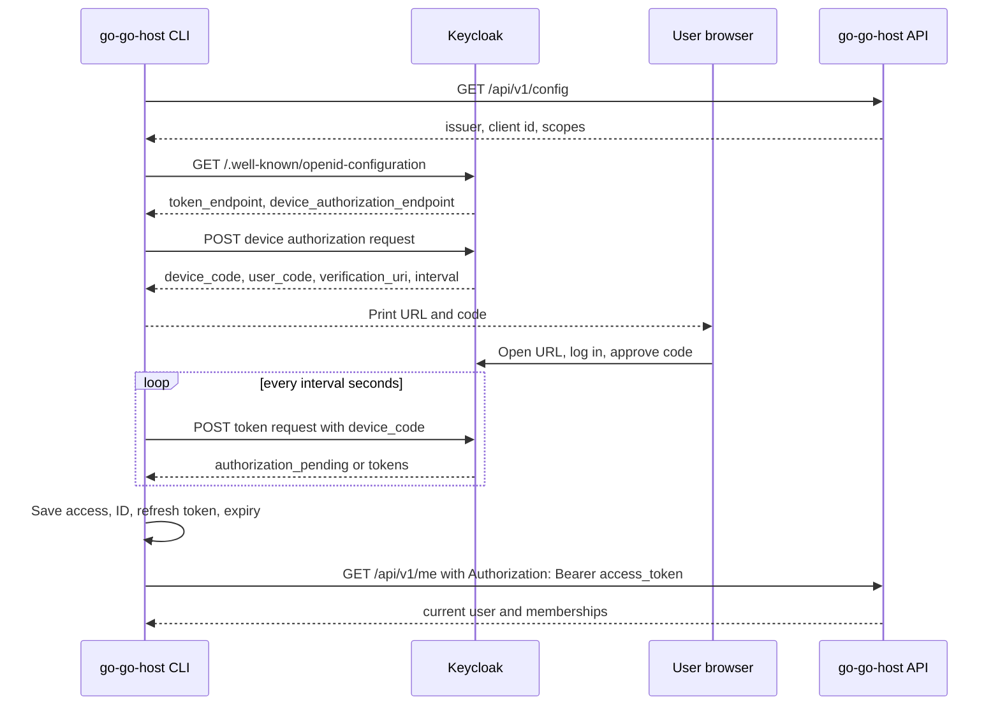

# OAuth Device Flow CLI Analysis Design and Implementation Guide

## Executive summary

`go-go-host` already has two authentication paths. The browser dashboard uses OIDC authorization code with PKCE against Keycloak. The human CLI currently has a temporary `login` command that stores either a development user header or a pasted bearer token. OAuth 2.0 Device Authorization Grant is the right next step for the CLI because it lets a terminal program obtain a real user token without asking the user to paste passwords or manually copy an access token.

Device flow splits login into two channels. The CLI talks directly to Keycloak over HTTP and asks for a short-lived `device_code`, a human-readable `user_code`, and a `verification_uri`. The user opens that URI in a browser, logs in normally through Keycloak, and confirms the code. While the user works in the browser, the CLI polls Keycloak's token endpoint. When Keycloak marks the device authorization as approved, the token endpoint returns an access token, ID token, and usually a refresh token.

For `go-go-host`, the target user experience is:

```bash
go-go-host login --api-url https://hosting.yolo.scapegoat.dev

Open this URL in your browser:
  https://auth.yolo.scapegoat.dev/realms/go-go-host/device

Enter this code:
  WDJB-MJHT

Waiting for browser authorization... done
Saved CLI session to ~/.config/go-go-host/config.yaml
```

After that, existing commands should work without passing `--bearer-token`:

```bash
go-go-host me
go-go-host org list
go-go-host site list --org-id org_...
go-go-host deploy --site-id site_... --path ./bundle.tar.gz
```

The implementation has four parts:

1. **Keycloak client configuration.** The public client used by the CLI must have Device Authorization Grant enabled. The current production endpoint exists, but the current client rejects device authorization with `unauthorized_client` because the flow is disabled for that client.
2. **CLI device-flow implementation.** `go-go-host login` must discover Keycloak metadata, request a device code, print instructions, poll correctly, and store returned tokens.
3. **Token refresh and request attachment.** Shared CLI HTTP helpers must use a valid access token, refresh it before or after expiry, and attach `Authorization: Bearer <token>`.
4. **Documentation and validation.** Local Keycloak import, production Terraform, CLI docs, and tests must describe and verify the full flow.

The recommended design is to create a separate public Keycloak client named `go-go-host-cli` rather than reusing `go-go-host-dashboard`. The backend already accepts tokens if the token audience or authorized party matches `Config.OIDCClientID`; that verifier should be extended to accept a list of API audiences/client IDs so both dashboard and CLI tokens can call the same API safely.

## Problem statement

The current CLI login command is deliberately a bridge. It stores a local API URL and one of two authentication inputs:

- `--dev-user`, which sends `X-Go-Go-Host-User` to a development server running with `devAuth: true`.
- `--bearer-token`, which stores a manually supplied OIDC token for non-dev smoke tests.

This is enough for early development, but it is not a good production login experience. A human should not need to extract an OIDC token from browser developer tools or copy it from another tool. The CLI also should not ask for the user's password because that bypasses the Keycloak-hosted login page, social login, required actions, MFA, and the custom OS1 theme.

OAuth Device Authorization Grant solves this specific problem. It lets the CLI start login from a terminal and lets Keycloak finish login in a browser. The CLI never sees the user's password. GitHub social login still happens inside Keycloak. Any future Keycloak policy, required action, or MFA step remains centralized in Keycloak.

This guide explains the protocol, maps the current codebase, proposes the exact changes, and gives an implementation plan suitable for an intern who knows Go but is new to OAuth and to `go-go-host`.

## Scope

This ticket is a design and implementation guide. It does not implement the feature yet.

In scope:

- Explain OAuth Device Authorization Grant and Keycloak's endpoint behavior.
- Map the existing CLI configuration and HTTP request path.
- Map the backend token verifier that will accept CLI tokens.
- Define the CLI config schema changes for device-flow tokens.
- Define polling behavior, refresh behavior, logout behavior, and failure handling.
- Define local Keycloak and production Terraform changes.
- Define tests and validation commands.

Out of scope for this design:

- Machine-to-machine deploy agents. Those already use enrollment tokens and Ed25519 signed requests. Device flow is for human CLI sessions, not durable automation identities.
- Replacing browser dashboard PKCE login. The dashboard should continue using authorization code with PKCE.
- Building a custom Keycloak device-verification page. Keycloak provides the verification interaction; theme polish can be a later ticket if necessary.

## Conceptual foundation: what device flow is

OAuth Device Authorization Grant is defined by RFC 8628. It was originally designed for devices with limited input capability, but the same shape works well for command-line tools. A CLI has a terminal, can make outbound HTTP requests, and can display a URL and a code. It usually should not run a local web server and should not capture a user's password.

The flow has two identifiers that must not be confused:

- `user_code` is for the human. It is short, readable, and shown in the terminal. The user types it into Keycloak if the browser URL does not already include it.
- `device_code` is for the CLI. It is long, opaque, and never shown as the thing the user should type. The CLI sends it to the token endpoint while polling.

The flow also has two URLs:

- `verification_uri` is the page the user visits in a browser.
- `verification_uri_complete` is an optional convenience URL that includes the `user_code`. The CLI should show it when Keycloak returns it, while also showing the separate `verification_uri` and `user_code` as a fallback.

A complete sequence looks like this:



The polling behavior is the part most implementations get wrong. RFC 8628 defines special token endpoint error codes:

| Error | Meaning | CLI behavior |
|---|---|---|
| `authorization_pending` | The user has not completed login/approval yet. | Wait at least the current interval and poll again. |
| `slow_down` | The request is still pending, but the client is polling too fast. | Increase the interval by 5 seconds and continue polling. |
| `access_denied` | The user denied the request. | Stop polling and show a clear error. |
| `expired_token` | The device code expired before approval. | Stop polling and tell the user to run `go-go-host login` again. |
| Any other OAuth error | Something else failed. | Stop polling and show the error/description. |

The interval is part of the security model. Polling every 100 milliseconds would waste Keycloak resources and can cause throttling. If Keycloak returns `interval: 5`, the CLI should wait five seconds before each token request. If `interval` is omitted, RFC 8628 says to use five seconds. If a network timeout occurs, RFC 8628 recommends reducing polling frequency; a simple exponential backoff on network timeouts is acceptable.

## Keycloak-specific behavior

Keycloak exposes the device authorization endpoint at:

```text
/realms/{realm-name}/protocol/openid-connect/auth/device
```

For production `go-go-host`, discovery currently advertises:

```text
issuer: https://auth.yolo.scapegoat.dev/realms/go-go-host
device_authorization_endpoint: https://auth.yolo.scapegoat.dev/realms/go-go-host/protocol/openid-connect/auth/device
token_endpoint: https://auth.yolo.scapegoat.dev/realms/go-go-host/protocol/openid-connect/token
```

The live discovery document also lists the device-code grant type:

```json
"grant_types_supported": [
  "authorization_code",
  "implicit",
  "refresh_token",
  "password",
  "client_credentials",
  "urn:openid:params:grant-type:ciba",
  "urn:ietf:params:oauth:grant-type:device_code"
]
```

That realm-level support is necessary but not sufficient. The client itself must be allowed to start device authorization. The current live client check returned:

```json
{
  "error": "unauthorized_client",
  "error_description": "Client is not allowed to initiate OAuth 2.0 Device Authorization Grant. The flow is disabled for the client."
}
```

This means the implementation must include a Keycloak client configuration change. In Terraform provider terms, the relevant `keycloak_openid_client` setting is:

```hcl
oauth2_device_authorization_grant_enabled = true
oauth2_device_code_lifespan              = "600"
oauth2_device_polling_interval           = "5"
```

The Terraform provider docs also expose `oauth2_device_code_lifespan` and `oauth2_device_polling_interval`. Use the defaults unless there is a reason to tune them. Ten minutes and five seconds are common defaults and match Keycloak's design note.

## Current-state architecture in go-go-host

### CLI login is currently a config writer

The current login command is in `cmd/go-go-host/cmds/login.go`. Its settings are only `api-url`, `dev-user`, and `bearer-token`:

```text
cmd/go-go-host/cmds/login.go:18-22
```

The current command help explicitly says it is a bridge command and that a browser OAuth flow can later reuse the same config file:

```text
cmd/go-go-host/cmds/login.go:42-50
```

The command currently rejects login unless either `--dev-user` or `--bearer-token` is supplied:

```text
cmd/go-go-host/cmds/login.go:66-68
```

Then it writes this config:

```go
type CLIConfig struct {
    APIURL      string `yaml:"apiUrl" json:"apiUrl"`
    DevUser     string `yaml:"devUser" json:"devUser"`
    BearerToken string `yaml:"bearerToken" json:"bearerToken"`
}
```

The config file path is either `GO_GO_HOST_CLI_CONFIG` or the OS user config directory:

```text
cmd/go-go-host/cmds/cli_config.go:18-27
```

The file is written with directory mode `0700` and file mode `0600`:

```text
cmd/go-go-host/cmds/cli_config.go:48-63
```

That is a reasonable baseline for storing tokens, but the schema needs to become explicit about token type, expiry, refresh token, issuer, and client ID.

### CLI commands already share auth helpers

Most human CLI commands call `resolveCLISettings`, then call `getJSONWithAuth`, `postJSONWithAuth`, or `postMultipartBundleWithAuth`. Those helpers live in `cmd/go-go-host/cmds/support.go`.

The request helper attaches the development user header when `devUser` is set:

```text
cmd/go-go-host/cmds/support.go:85-87
```

It attaches a bearer token when `bearerToken` is set:

```text
cmd/go-go-host/cmds/support.go:88-90
```

This is the right central point to integrate refresh-aware token loading. The implementation should avoid changing every command one by one. Instead, change the config and helper layer so every existing command benefits.

Current commands using the shared path include:

- `me`
- `org list` and `org create`
- `site list`, `site create`, and `site runtime`
- `deploy`, `deployments list`, `deployments show`, `deployments activate`, and `rollback`
- `agents` and `audit`
- maintenance commands

### Backend auth already accepts OIDC bearer tokens

The backend verifier is in `internal/httpapi/oidc.go`. It extracts `Authorization: Bearer <token>`, discovers the OIDC provider, verifies the token signature/issuer/expiry, decodes claims, and upserts the user from OIDC subject and email.

Important lines:

```text
internal/httpapi/oidc.go:43-70   authenticate request and enforce token client match
internal/httpapi/oidc.go:78      upsert user from issuer/subject/email/name
internal/httpapi/oidc.go:144-162 discover provider and build verifier
internal/httpapi/oidc.go:165-177 accept aud or azp match
```

The verifier currently uses one configured client ID from `Config.OIDCClientID`. That was correct when only the dashboard client called the API. If the CLI receives tokens for a separate client, the verifier needs to accept that CLI client as well. There are two implementation choices:

1. Reuse the dashboard client for CLI device flow. This avoids backend verifier changes, but mixes browser and CLI client concerns.
2. Create a separate `go-go-host-cli` client and extend backend config to accept multiple allowed client IDs. This is cleaner and recommended.

The recommended approach is separate client plus backend `OIDCAcceptedClientIDs` or `OIDCAudiences` configuration.

### Public config endpoint already gives the browser OIDC settings

`internal/httpapi/handler.go` exposes `GET /api/v1/config` without authentication. It returns OIDC settings when `devAuth` is false:

```text
internal/httpapi/handler.go:28-43
```

The browser uses that endpoint to learn the issuer, client ID, scopes, and redirect paths. The CLI can use the same endpoint as a bootstrap source. For device flow, the API config response should include a CLI client ID when one exists:

```json
{
  "devAuth": false,
  "oidc": {
    "issuer": "https://auth.yolo.scapegoat.dev/realms/go-go-host",
    "clientId": "go-go-host-dashboard",
    "cliClientId": "go-go-host-cli",
    "scopes": ["openid", "profile", "email"]
  }
}
```

This avoids hard-coding the Keycloak issuer or client ID in the CLI.

## Proposed architecture

The design has one main rule: the CLI should behave like a public OAuth client, and the API should continue to validate signed Keycloak tokens locally. The CLI does not need a client secret. A distributed command-line binary cannot keep a static client secret confidential.

### Recommended Keycloak clients

Use two public clients:

| Client | Purpose | Flow |
|---|---|---|
| `go-go-host-dashboard` | Browser dashboard SPA | Authorization code with PKCE |
| `go-go-host-cli` | Human terminal CLI | Device Authorization Grant plus refresh token |

Keeping them separate has practical benefits:

- The CLI client can enable device flow without changing dashboard behavior.
- Token `azp` identifies whether a token came from the dashboard or CLI.
- Future CLI-specific policies, session lifespan, consent text, or device-flow intervals can be changed without affecting the dashboard.
- Auditing and debugging are easier because Keycloak session/client data distinguishes the caller.

The API should accept tokens from both clients:

```yaml
oidcIssuer: https://auth.yolo.scapegoat.dev/realms/go-go-host
oidcClientId: go-go-host-dashboard
oidcAcceptedClientIds:
  - go-go-host-dashboard
  - go-go-host-cli
```

The existing `oidcClientId` can remain for backwards compatibility and dashboard config. The new accepted-client list should default to `[oidcClientId]` when omitted.

### CLI config schema

The current config stores one `bearerToken`. Device flow needs structured token data:

```yaml
apiUrl: https://hosting.yolo.scapegoat.dev

devUser: ""             # still supported for local dev
bearerToken: ""         # keep as manual override/fallback, but stop writing it for device flow

oidc:
  issuer: https://auth.yolo.scapegoat.dev/realms/go-go-host
  clientId: go-go-host-cli
  scopes:
    - openid
    - profile
    - email
  accessToken: eyJ...
  idToken: eyJ...
  refreshToken: eyJ...
  tokenType: Bearer
  expiresAt: "2026-05-13T13:30:00Z"
```

A Go shape for this config:

```go
type CLIConfig struct {
    APIURL      string          `yaml:"apiUrl" json:"apiUrl"`
    DevUser     string          `yaml:"devUser,omitempty" json:"devUser,omitempty"`
    BearerToken string          `yaml:"bearerToken,omitempty" json:"bearerToken,omitempty"`
    OIDC        *CLIOIDCSession `yaml:"oidc,omitempty" json:"oidc,omitempty"`
}

type CLIOIDCSession struct {
    Issuer       string    `yaml:"issuer" json:"issuer"`
    ClientID     string    `yaml:"clientId" json:"clientId"`
    Scopes       []string  `yaml:"scopes" json:"scopes"`
    AccessToken  string    `yaml:"accessToken" json:"accessToken"`
    IDToken      string    `yaml:"idToken,omitempty" json:"idToken,omitempty"`
    RefreshToken string    `yaml:"refreshToken,omitempty" json:"refreshToken,omitempty"`
    TokenType    string    `yaml:"tokenType,omitempty" json:"tokenType,omitempty"`
    ExpiresAt    time.Time `yaml:"expiresAt,omitempty" json:"expiresAt,omitempty"`
}
```

The `bearerToken` field should remain for compatibility with smoke tests and one-off debugging. Device login should populate `OIDC`, not `BearerToken`.

### Discovery types

The CLI should use discovery rather than assembling Keycloak URLs by hand. RFC 8414 and Keycloak's OIDC discovery document expose the endpoints needed by device flow.

```go
type oidcDiscovery struct {
    Issuer                      string   `json:"issuer"`
    TokenEndpoint               string   `json:"token_endpoint"`
    DeviceAuthorizationEndpoint string   `json:"device_authorization_endpoint"`
    RevocationEndpoint          string   `json:"revocation_endpoint"`
    GrantTypesSupported         []string `json:"grant_types_supported"`
}
```

If `device_authorization_endpoint` is missing, `go-go-host login` should fail with a message that the issuer does not support device flow.

### Device authorization request and response

The initial request is form-encoded:

```http
POST {device_authorization_endpoint}
Content-Type: application/x-www-form-urlencoded

client_id=go-go-host-cli&scope=openid%20profile%20email
```

Response:

```go
type deviceAuthorizationResponse struct {
    DeviceCode             string `json:"device_code"`
    UserCode               string `json:"user_code"`
    VerificationURI        string `json:"verification_uri"`
    VerificationURIComplete string `json:"verification_uri_complete"`
    ExpiresIn              int    `json:"expires_in"`
    Interval               int    `json:"interval"`
}
```

The CLI should print both the complete URL and the code. The complete URL is convenient; the separate code is necessary when the user's browser/device cannot use the complete URL directly.

### Token polling request and response

The polling request is also form-encoded:

```http
POST {token_endpoint}
Content-Type: application/x-www-form-urlencoded

grant_type=urn:ietf:params:oauth:grant-type:device_code&client_id=go-go-host-cli&device_code=...
```

Successful response:

```go
type tokenResponse struct {
    AccessToken      string `json:"access_token"`
    IDToken          string `json:"id_token"`
    RefreshToken     string `json:"refresh_token"`
    TokenType        string `json:"token_type"`
    ExpiresIn        int    `json:"expires_in"`
    RefreshExpiresIn int    `json:"refresh_expires_in"`
    Scope            string `json:"scope"`
}
```

Error response:

```go
type oauthErrorResponse struct {
    Error            string `json:"error"`
    ErrorDescription string `json:"error_description"`
}
```

### Refresh request

When a command runs after the access token is close to expiry, the CLI should refresh automatically if a refresh token exists:

```http
POST {token_endpoint}
Content-Type: application/x-www-form-urlencoded

grant_type=refresh_token&client_id=go-go-host-cli&refresh_token=...
```

Refresh should update the saved access token, optional ID token, optional refresh token, and expiry. Some providers rotate refresh tokens. The implementation must store the new refresh token if the response includes one; if not, keep the old refresh token.

### Logout and revocation

A future `go-go-host logout` should do two things:

1. Revoke the refresh token through the revocation endpoint when available.
2. Delete local tokens even if revocation fails.

RFC 7009 defines token revocation. Keycloak documents `/realms/{realm-name}/protocol/openid-connect/revoke`. For a public client, the CLI sends `client_id` and `token`.

Pseudocode:

```go
func logout(cfg CLIConfig) error {
    if cfg.OIDC != nil && cfg.OIDC.RefreshToken != "" {
        discovery := discover(cfg.OIDC.Issuer)
        if discovery.RevocationEndpoint != "" {
            _ = revoke(discovery.RevocationEndpoint, cfg.OIDC.ClientID, cfg.OIDC.RefreshToken)
        }
    }
    cfg.OIDC = nil
    cfg.BearerToken = ""
    _, err := saveCLIConfig(cfg)
    return err
}
```

Revocation should be best-effort because local cleanup is still required if the network is unavailable.

## Implementation plan

### Phase 1: Enable Keycloak client support

Production Terraform file:

```text
/home/manuel/code/wesen/terraform/keycloak/apps/go-go-host/envs/k3s-beta/main.tf
```

Recommended production Terraform shape:

```hcl
resource "keycloak_openid_client" "cli" {
  realm_id                        = module.realm.id
  client_id                       = var.cli_client_id
  name                            = var.cli_client_id
  enabled                         = true
  access_type                     = "PUBLIC"
  standard_flow_enabled           = false
  direct_access_grants_enabled    = false
  service_accounts_enabled        = false
  use_refresh_tokens              = true
  oauth2_device_authorization_grant_enabled = true
  oauth2_device_code_lifespan              = "600"
  oauth2_device_polling_interval           = "5"
}
```

Add variables:

```hcl
variable "cli_client_id" {
  type    = string
  default = "go-go-host-cli"
}
```

If the first implementation chooses to reuse the dashboard client, add these to `keycloak_openid_client.dashboard` instead:

```hcl
oauth2_device_authorization_grant_enabled = true
oauth2_device_code_lifespan              = "600"
oauth2_device_polling_interval           = "5"
```

The separate-client design is cleaner, but reusing the dashboard client is a smaller change. If reusing the dashboard client, document the decision and revisit later.

Local Keycloak import file:

```text
deployments/dev/keycloak/realm-go-go-host.json
```

Add a second client entry for `go-go-host-cli`, or add the device grant attribute to the existing dashboard client. The Keycloak JSON attribute name is:

```json
"oauth2.device.authorization.grant.enabled": "true"
```

A local client sketch:

```json
{
  "clientId": "go-go-host-cli",
  "name": "go-go-host CLI",
  "enabled": true,
  "publicClient": true,
  "protocol": "openid-connect",
  "standardFlowEnabled": false,
  "implicitFlowEnabled": false,
  "directAccessGrantsEnabled": false,
  "serviceAccountsEnabled": false,
  "attributes": {
    "oauth2.device.authorization.grant.enabled": "true",
    "oauth2.device.code.lifespan": "600",
    "oauth2.device.polling.interval": "5"
  }
}
```

Validation after Keycloak config:

```bash
curl -sS -X POST \
  -d 'client_id=go-go-host-cli' \
  -d 'scope=openid profile email' \
  https://auth.yolo.scapegoat.dev/realms/go-go-host/protocol/openid-connect/auth/device | jq .
```

Expected response shape:

```json
{
  "device_code": "...",
  "user_code": "ABCD-EFGH",
  "verification_uri": "https://auth.yolo.scapegoat.dev/realms/go-go-host/device",
  "verification_uri_complete": "https://auth.yolo.scapegoat.dev/realms/go-go-host/device?user_code=ABCD-EFGH",
  "expires_in": 600,
  "interval": 5
}
```

### Phase 2: Extend backend accepted client IDs

Current backend config has one `OIDCClientID`:

```text
internal/config/config.go:22-26
```

Add a list field:

```go
type Config struct {
    OIDCIssuer            string   `json:"oidcIssuer" yaml:"oidcIssuer"`
    OIDCClientID          string   `json:"oidcClientId" yaml:"oidcClientId"`
    OIDCAcceptedClientIDs []string `json:"oidcAcceptedClientIds" yaml:"oidcAcceptedClientIds"`
    OIDCDeviceClientID    string   `json:"oidcDeviceClientId" yaml:"oidcDeviceClientId"`
    // ...
}
```

Apply defaults:

```go
func (c *Config) ApplyDefaults() {
    // existing defaults...
    if len(c.OIDCAcceptedClientIDs) == 0 && c.OIDCClientID != "" {
        c.OIDCAcceptedClientIDs = []string{c.OIDCClientID}
    }
}
```

Then change `tokenMatchesClient` to accept a set:

```go
func tokenMatchesAnyClient(clientIDs []string, tokenAudience []string, claims oidcClaims) bool {
    for _, clientID := range clientIDs {
        if tokenMatchesClient(clientID, tokenAudience, claims) {
            return true
        }
    }
    return false
}
```

In `authenticate`, use:

```go
accepted := a.cfg.OIDCAcceptedClientIDs
if len(accepted) == 0 {
    accepted = []string{a.cfg.OIDCClientID}
}
if !tokenMatchesAnyClient(accepted, verifiedToken.Audience, claims) {
    return nil, fmt.Errorf("verify oidc bearer token: expected audience or authorized party in %q", accepted)
}
```

Keep the verifier configured with `SkipClientIDCheck: true`, as it already is. The code currently verifies issuer/signature/expiry first, then enforces `aud` or `azp` locally. That pattern still works when multiple allowed clients exist.

Update `/api/v1/config` to include the device client ID:

```go
response["oidc"] = map[string]any{
    "issuer":             core.Config.OIDCIssuer,
    "clientId":           core.Config.OIDCClientID,
    "deviceClientId":     core.Config.OIDCDeviceClientID,
    "scopes":             core.Config.OIDCScopes,
    "redirectPath":       core.Config.OIDCRedirectPath,
    "logoutRedirectPath": core.Config.OIDCLogoutRedirectPath,
}
```

For production config, set:

```yaml
oidcClientId: go-go-host-dashboard
oidcDeviceClientId: go-go-host-cli
oidcAcceptedClientIds:
  - go-go-host-dashboard
  - go-go-host-cli
```

### Phase 3: Add CLI OIDC/device-flow support package

Create a small internal package under the CLI command tree. Keep it unexported unless other binaries need it.

Recommended file:

```text
cmd/go-go-host/cmds/oidc_device.go
```

Responsibilities:

- Fetch `/api/v1/config` from `apiUrl`.
- Fetch OIDC discovery from `issuer + "/.well-known/openid-configuration"`.
- Start device authorization.
- Poll token endpoint.
- Refresh tokens.
- Optionally revoke tokens.

Pseudocode for discovery:

```go
func discoverOIDC(ctx context.Context, issuer string) (oidcDiscovery, error) {
    url := strings.TrimRight(issuer, "/") + "/.well-known/openid-configuration"
    req, _ := http.NewRequestWithContext(ctx, http.MethodGet, url, nil)
    resp, err := http.DefaultClient.Do(req)
    if err != nil { return oidcDiscovery{}, err }
    defer resp.Body.Close()
    if resp.StatusCode != http.StatusOK { return oidcDiscovery{}, decodeHTTPError(resp) }
    var doc oidcDiscovery
    if err := json.NewDecoder(resp.Body).Decode(&doc); err != nil { return oidcDiscovery{}, err }
    if doc.DeviceAuthorizationEndpoint == "" { return oidcDiscovery{}, errors.New("issuer does not advertise device_authorization_endpoint") }
    if doc.TokenEndpoint == "" { return oidcDiscovery{}, errors.New("issuer does not advertise token_endpoint") }
    return doc, nil
}
```

Pseudocode for starting device authorization:

```go
func startDeviceAuthorization(ctx context.Context, endpoint, clientID string, scopes []string) (deviceAuthorizationResponse, error) {
    form := url.Values{}
    form.Set("client_id", clientID)
    form.Set("scope", strings.Join(scopes, " "))

    req, _ := http.NewRequestWithContext(ctx, http.MethodPost, endpoint, strings.NewReader(form.Encode()))
    req.Header.Set("Content-Type", "application/x-www-form-urlencoded")

    resp, err := http.DefaultClient.Do(req)
    if err != nil { return deviceAuthorizationResponse{}, err }
    defer resp.Body.Close()

    if resp.StatusCode < 200 || resp.StatusCode >= 300 {
        return deviceAuthorizationResponse{}, decodeOAuthError(resp)
    }
    var out deviceAuthorizationResponse
    if err := json.NewDecoder(resp.Body).Decode(&out); err != nil { return out, err }
    if out.Interval <= 0 { out.Interval = 5 }
    return out, nil
}
```

Pseudocode for polling:

```go
func pollDeviceToken(ctx context.Context, tokenEndpoint, clientID, deviceCode string, intervalSeconds, expiresIn int) (tokenResponse, error) {
    interval := time.Duration(defaultInt(intervalSeconds, 5)) * time.Second
    deadline := time.Now().Add(time.Duration(expiresIn) * time.Second)

    for {
        if time.Now().After(deadline) {
            return tokenResponse{}, errors.New("device authorization expired before approval")
        }

        select {
        case <-ctx.Done():
            return tokenResponse{}, ctx.Err()
        case <-time.After(interval):
        }

        tok, oauthErr, err := requestDeviceToken(ctx, tokenEndpoint, clientID, deviceCode)
        if err != nil {
            interval *= 2
            if interval > 30*time.Second { interval = 30*time.Second }
            continue
        }
        if oauthErr == nil {
            return tok, nil
        }

        switch oauthErr.Error {
        case "authorization_pending":
            continue
        case "slow_down":
            interval += 5 * time.Second
            continue
        case "access_denied":
            return tokenResponse{}, errors.New("login denied in browser")
        case "expired_token":
            return tokenResponse{}, errors.New("device code expired; run login again")
        default:
            return tokenResponse{}, fmt.Errorf("oauth error: %s: %s", oauthErr.Error, oauthErr.ErrorDescription)
        }
    }
}
```

### Phase 4: Update `go-go-host login`

The `login` command should support three modes:

| Mode | Trigger | Behavior |
|---|---|---|
| Dev mode | `--dev-user` | Preserve existing behavior. |
| Manual token mode | `--bearer-token` | Preserve existing behavior for smoke tests. |
| Device flow mode | neither `--dev-user` nor `--bearer-token` | Start OAuth Device Authorization Grant. |

New useful flags:

```text
--client-id               optional override; defaults to config oidc.deviceClientId or oidc.clientId
--scope                   repeatable or comma-separated; defaults to OIDC config scopes
--timeout                 max wait time; defaults to device expires_in
--no-open                 do not try to open browser automatically
```

The first implementation can skip automatic browser opening and only print the URL. If adding browser opening, use a small cross-platform helper and make failure non-fatal.

Login pseudocode:

```go
func (c *LoginCommand) RunIntoGlazeProcessor(ctx context.Context, vals *values.Values, gp middlewares.Processor) error {
    settings := decodeLoginSettings(vals)

    if settings.DevUser != "" || settings.BearerToken != "" {
        return saveBridgeLogin(settings)
    }

    apiCfg := fetchPublicConfig(settings.APIURL)
    oidcCfg := apiCfg.OIDC
    clientID := firstNonEmpty(settings.ClientID, oidcCfg.DeviceClientID, oidcCfg.ClientID)
    scopes := firstNonEmptyList(settings.Scopes, oidcCfg.Scopes, []string{"openid", "profile", "email"})

    discovery := discoverOIDC(ctx, oidcCfg.Issuer)
    device := startDeviceAuthorization(ctx, discovery.DeviceAuthorizationEndpoint, clientID, scopes)

    printDeviceInstructions(device)
    token := pollDeviceToken(ctx, discovery.TokenEndpoint, clientID, device.DeviceCode, device.Interval, device.ExpiresIn)

    cfg := CLIConfig{
        APIURL: settings.APIURL,
        OIDC: &CLIOIDCSession{
            Issuer: oidcCfg.Issuer,
            ClientID: clientID,
            Scopes: scopes,
            AccessToken: token.AccessToken,
            IDToken: token.IDToken,
            RefreshToken: token.RefreshToken,
            TokenType: token.TokenType,
            ExpiresAt: time.Now().Add(time.Duration(token.ExpiresIn) * time.Second),
        },
    }
    path := saveCLIConfig(cfg)
    me := callMeWithAccessToken(cfg)
    emit login summary row
}
```

The command should call `/api/v1/me` after storing tokens. This validates that the API accepts the token and gives the user immediate feedback about who they logged in as.

### Phase 5: Make shared HTTP helpers refresh-aware

Do not spread refresh logic into every command. Add one resolver that returns the right auth header.

Recommended shape:

```go
type ResolvedCLISettings struct {
    APIURL      string
    DevUser     string
    BearerToken string
    Config      CLIConfig
}

func resolveCLISettings(ctx context.Context, apiURL, devUser, bearerToken string) (ResolvedCLISettings, error) {
    cfg := loadCLIConfig()
    applyFlagOverrides(&cfg, apiURL, devUser, bearerToken)

    if cfg.DevUser != "" || cfg.BearerToken != "" || cfg.OIDC == nil {
        return ResolvedCLISettings{APIURL: cfg.APIURL, DevUser: cfg.DevUser, BearerToken: cfg.BearerToken, Config: cfg}, nil
    }

    if tokenExpiresSoon(cfg.OIDC.ExpiresAt) && cfg.OIDC.RefreshToken != "" {
        refreshed := refreshOIDCToken(ctx, cfg.OIDC)
        cfg.OIDC = refreshed
        saveCLIConfig(cfg)
    }

    return ResolvedCLISettings{APIURL: cfg.APIURL, BearerToken: cfg.OIDC.AccessToken, Config: cfg}, nil
}
```

Commands currently call `resolveCLISettings` without context. It is acceptable to add context and update command call sites, or to keep the old function name as a wrapper and introduce `resolveCLISettingsWithRefresh` for commands to migrate to.

### Phase 6: Add `go-go-host logout`

Add a logout command to the root command. It should clear local auth state and optionally revoke refresh tokens.

Command behavior:

```bash
go-go-host logout
```

Output row:

```text
config_path: ~/.config/go-go-host/config.yaml
revoked: true|false
cleared: true
```

Logout must not fail to clear local tokens just because Keycloak is offline.

## Testing strategy

### Unit tests for polling

Add tests that use `httptest.Server` as a fake token endpoint.

Cases:

- `authorization_pending` twice, then success.
- `slow_down` increases the interval before success.
- `access_denied` stops with a human-readable error.
- `expired_token` stops with a rerun-login message.
- Unknown OAuth error stops and includes `error_description`.
- Network timeout backs off rather than tight-looping.

Use a fake sleeper or injectable clock so tests do not actually wait five seconds per poll.

Pseudocode:

```go
type pollerClock interface {
    Sleep(ctx context.Context, d time.Duration) error
    Now() time.Time
}
```

Then production uses a real clock and tests use a recording clock.

### Unit tests for config migration

Existing config files with only `bearerToken` must still load.

Test inputs:

```yaml
apiUrl: http://127.0.0.1:8080
devUser: alice
```

```yaml
apiUrl: https://hosting.yolo.scapegoat.dev
bearerToken: eyJ...
```

```yaml
apiUrl: https://hosting.yolo.scapegoat.dev
oidc:
  issuer: https://auth.yolo.scapegoat.dev/realms/go-go-host
  clientId: go-go-host-cli
  accessToken: eyJ...
  refreshToken: eyJ...
  expiresAt: "2026-05-13T13:30:00Z"
```

Assertions:

- Dev config still sends `X-Go-Go-Host-User`.
- Manual bearer config still sends `Authorization`.
- OIDC config sends `Authorization` with `accessToken`.
- Expiring OIDC config invokes refresh and writes the new token.

### Backend auth tests

Extend `internal/httpapi/oidc_bootstrap_test.go` or add a new test for accepted client IDs.

Cases:

- Dashboard token still matches `go-go-host-dashboard`.
- CLI token with `azp=go-go-host-cli` matches when accepted list includes it.
- CLI token is rejected when accepted list omits it.
- `aud` match works for both clients.

### Local integration test

With dev Keycloak running:

```bash
devctl up --force
curl -sS -X POST \
  -d 'client_id=go-go-host-cli' \
  -d 'scope=openid profile email' \
  http://127.0.0.1:18080/realms/go-go-host/protocol/openid-connect/auth/device | jq .
```

Then run:

```bash
GO_GO_HOST_CLI_CONFIG=$(mktemp) go run ./cmd/go-go-host login --api-url http://127.0.0.1:8080
GO_GO_HOST_CLI_CONFIG=$same go run ./cmd/go-go-host me --output json
```

### Production smoke test

After Terraform apply:

```bash
curl -sS -X POST \
  -d 'client_id=go-go-host-cli' \
  -d 'scope=openid profile email' \
  https://auth.yolo.scapegoat.dev/realms/go-go-host/protocol/openid-connect/auth/device | jq .
```

Expected: JSON containing `device_code` and `user_code`, not `unauthorized_client`.

Then:

```bash
GO_GO_HOST_CLI_CONFIG=$(mktemp) go-go-host login --api-url https://hosting.yolo.scapegoat.dev
GO_GO_HOST_CLI_CONFIG=$same go-go-host me --output table
```

## Security considerations

### Do not use Resource Owner Password Credentials

Keycloak's docs state that Resource Owner Password Credentials, called Direct Grant in Keycloak, exposes user credentials to the application and bypasses important authentication behavior. Device flow preserves Keycloak as the only place where the user enters credentials.

### Treat refresh tokens as secrets

The CLI config file is already written as `0600`, which is the minimum acceptable baseline. The implementation should avoid printing tokens in normal output. Error logs and Glazed output rows should report booleans such as `has_refresh_token`, not token values.

A later hardening step can move token storage to OS keychain/secret-service APIs. That is not required for the first implementation, but the config schema should make it possible to move token storage later.

### Do not use device flow for deploy agents

Device flow authenticates a human user. Deploy agents are long-running automation identities and should continue using enrollment tokens and signed requests. Mixing these would weaken the audit model.

### Handle phishing-resistant UX basics

The CLI should show the code clearly and tell the user to verify that the browser page shows the same code. If `verification_uri_complete` is used, Keycloak should still display the code for confirmation. This is part of the device-flow security model.

Recommended terminal text:

```text
Open the following URL in your browser and confirm the code shown there matches this terminal.

URL:  https://auth.yolo.scapegoat.dev/realms/go-go-host/device?user_code=WDJB-MJHT
Code: WDJB-MJHT

Do not approve this request if the browser shows a different code.
```

### Respect polling intervals

The CLI must not poll faster than Keycloak instructs. It must implement `slow_down`. This protects Keycloak and follows RFC 8628.

## Alternatives considered

### Keep manual `--bearer-token`

This is already implemented and should remain as a fallback, but it is not a user-friendly production login. It requires users to obtain a token elsewhere and paste it into the CLI.

### Authorization code with loopback redirect

RFC 8252 recommends authorization code with PKCE for native apps that can open a browser and receive a redirect on a local loopback server. That is a good pattern for desktop apps and some CLIs. It requires the CLI to bind a local port and handle browser redirects. Device flow is simpler for the first `go-go-host` CLI login and works even over SSH or in constrained terminals.

### Authorization code with out-of-band copy/paste

Keycloak supports special out-of-band redirect behavior in some cases, but it requires the user to copy an authorization code back into the CLI. Device flow is better because the CLI only asks the user to open a URL and approve a code; token delivery happens through polling.

### Resource Owner Password Credentials

Reject this option. The CLI would ask for the user's password and send it to Keycloak. That breaks social login, MFA, required actions, and the principle that only Keycloak handles credentials.

### Client credentials

Reject this option for human CLI login. Client credentials authenticate an application, not a user. `go-go-host` user actions need user identity, org membership, platform-admin checks, and audit trails.

## File-level implementation checklist

### App repo

- `cmd/go-go-host/cmds/login.go`
  - Add device-flow mode when neither `--dev-user` nor `--bearer-token` is supplied.
  - Add optional flags for `--client-id`, `--scope`, `--timeout`, and maybe `--no-open`.
  - Save structured OIDC session data.
  - Validate login with `/api/v1/me`.

- `cmd/go-go-host/cmds/cli_config.go`
  - Add `CLIOIDCSession`.
  - Preserve loading existing configs.
  - Save token fields with `0600` permissions.

- `cmd/go-go-host/cmds/support.go`
  - Add refresh-aware auth resolution.
  - Keep existing `devUser` and manual bearer behavior.
  - Ensure multipart deploys use refreshed tokens too.

- `cmd/go-go-host/cmds/oidc_device.go`
  - New file for discovery, device authorization, polling, refresh, and revocation helpers.

- `cmd/go-go-host/root.go`
  - Register future `logout` command.

- `cmd/go-go-host/doc/login-and-config.md`
  - Replace manual-token-first docs with device-flow docs.
  - Keep dev auth and manual bearer sections as advanced/fallback modes.

- `internal/config/config.go`
  - Add accepted OIDC client IDs and device client ID.

- `internal/httpapi/oidc.go`
  - Accept multiple client IDs for `aud`/`azp` matching.

- `internal/httpapi/handler.go`
  - Include `deviceClientId` in `/api/v1/config`.

- `deployments/dev/keycloak/realm-go-go-host.json`
  - Add or enable local `go-go-host-cli` device-flow client.

### Terraform repo

- `/home/manuel/code/wesen/terraform/keycloak/apps/go-go-host/envs/k3s-beta/main.tf`
  - Add `keycloak_openid_client.cli` or enable device flow on the existing dashboard client.

- `/home/manuel/code/wesen/terraform/keycloak/apps/go-go-host/envs/k3s-beta/variables.tf`
  - Add `cli_client_id` and optional device flow timing variables.

- `/home/manuel/code/wesen/terraform/keycloak/apps/go-go-host/envs/k3s-beta/outputs.tf`
  - Output `cli_client_id` for operator visibility.

## References

Ticket sources are indexed in:

```text
ttmp/2026/05/13/HOST-011-OAUTH-DEVICE-FLOW-CLI--oauth-device-flow-for-go-go-host-cli/sources/00-sources-readme.md
```

Key sources:

- RFC 8628: OAuth 2.0 Device Authorization Grant.
- RFC 8414: OAuth 2.0 Authorization Server Metadata.
- RFC 7009: OAuth 2.0 Token Revocation.
- RFC 8252: OAuth 2.0 for Native Apps.
- Keycloak OIDC layers documentation.
- Keycloak community device authorization grant design note.
- Terraform Keycloak provider `keycloak_openid_client` docs.
- Live production OIDC discovery JSON and disabled-client response.

## Open questions

1. Should the first implementation create `go-go-host-cli`, or temporarily reuse `go-go-host-dashboard` to minimize backend verifier changes?
2. Should token storage remain in YAML for beta, or should the first implementation use an OS keychain package?
3. Should `go-go-host login` try to open the browser automatically, or only print the URL for maximum SSH compatibility?
4. Should refresh happen proactively before every command when the token expires within 60 seconds, or only reactively after a 401?

## Recommended first implementation path

Use the separate `go-go-host-cli` client, extend the API verifier to accept both dashboard and CLI client IDs, and store tokens in the existing YAML config with `0600` permissions for beta. This gives the cleanest auth model while keeping implementation scope manageable.

The first pull request should do the work in this order:

1. Add local Keycloak and Terraform client support for `go-go-host-cli` with device flow enabled.
2. Add backend accepted client ID config and tests.
3. Add CLI device-flow helpers and unit tests.
4. Update `login` to run device flow by default.
5. Add refresh-aware auth resolution for all existing commands.
6. Update docs and run local/prod smoke tests.

## Implementation status as of commit `0614a5f`

The first implementation pass has now completed the main design path described above:

- The backend config supports `oidcDeviceClientId` and `oidcAcceptedClientIds`.
- The backend OIDC verifier accepts tokens from any configured accepted client by `aud` or `azp` while still verifying issuer, signature, and expiry.
- Local Keycloak imports a `go-go-host-cli` public client with Device Authorization Grant enabled.
- Production Terraform manages `keycloak_openid_client.cli` with Device Authorization Grant enabled.
- Production Keycloak returns real device authorization responses for `client_id=go-go-host-cli`.
- `go-go-host login` starts device flow by default when neither `--dev-user` nor `--bearer-token` is provided.
- The CLI stores structured OIDC session data and refreshes access tokens before requests when possible.
- `go-go-host logout` clears local auth state and best-effort revokes the refresh token.
- Production app image `ghcr.io/go-go-golems/go-go-host:sha-0614a5f` is deployed through GitOps.
- Production `/api/v1/config` now publishes `deviceClientId: go-go-host-cli`.

The remaining manual validation step is a browser-approved production login smoke:

```bash
GO_GO_HOST_CLI_CONFIG=$(mktemp) \
  go-go-host login --api-url https://hosting.yolo.scapegoat.dev

GO_GO_HOST_CLI_CONFIG=$same \
  go-go-host me --output table
```

A non-approved smoke was run with a timeout and confirmed that the CLI prints a live Keycloak verification URL and user code before polling.
